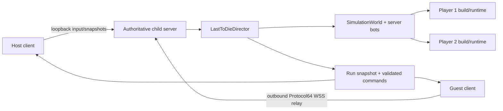
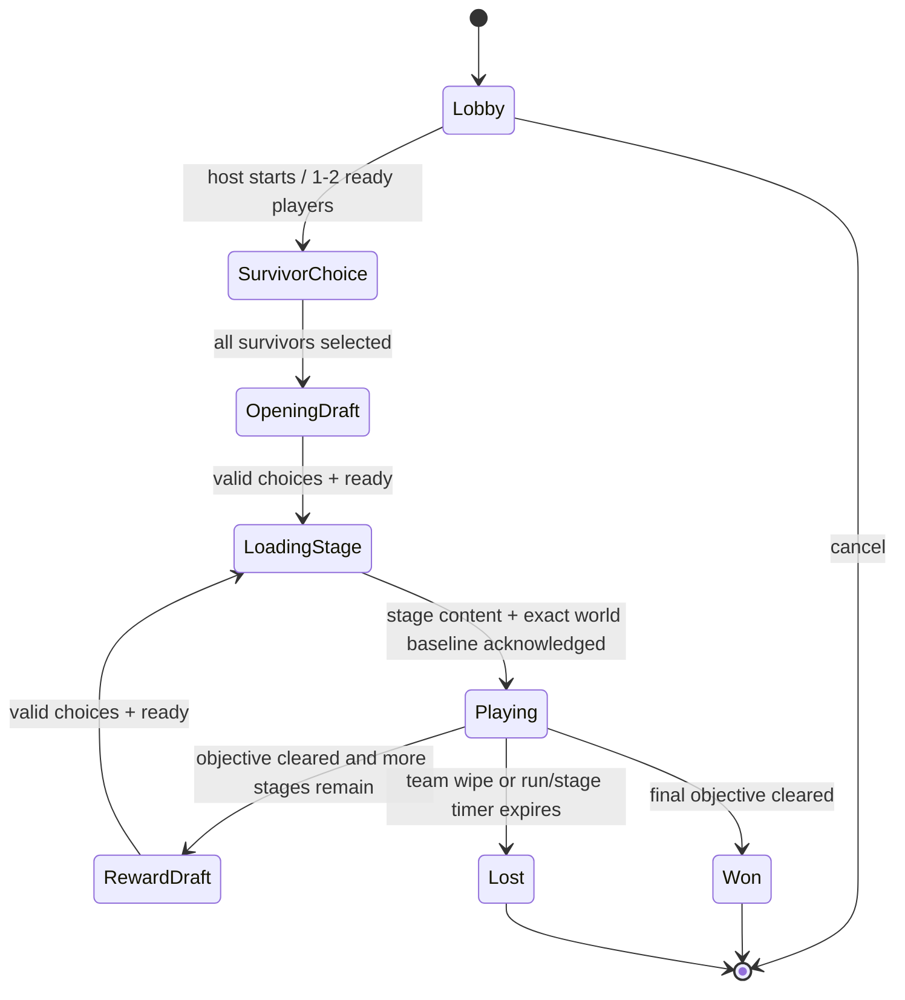

# Last to Die: two-player co-op and class expansion blueprint

Status: release-scope implementation complete; the direct two-player hosted-co-op MVP and all 63 requested perks are operational
Scope reviewed: the non-`Modern` C# solution as of 2026-08-14
Feature scope: server-authoritative two-player co-op plus all 63 requested Spy, Medic, and Sniper perks

## Release checkpoint (2026-08-14)

The implementation has moved beyond the incremental checkpoint below. At the release boundary:

- The full 25-perk Spy, 20-perk Medic, and 18-perk Sniper catalogs are authoritative, prediction-safe where client input depends on them, and covered by focused behavior/lifecycle tests.
- Desktop co-op is a private-by-default, one- or two-playable-slot hosted run. The host uses loopback UDP to its child server; the guest defaults to an outbound Protocol64 WSS relay, with direct UDP retained as a fallback. Commands are idempotent and retried with the same command ID; cached results are replayed before rate limiting; the authoritative roster rejects late additions; and a reconnect cannot resume input until both semantic run state and the world baseline are acknowledged.
- The host and guest are ordinary clients of one authoritative `GameServer`/`LastToDieServerDirector`. Per-player builds, run rewards, objectives, combat, bots, deaths, reconnect reservations, stage transitions, and team-wipe/Afterlife decisions are server-owned.
- The handshake carries a persistent client-instance ID. The server resolves that ID to its reserved logical slot before ordinary allocation, can replace a stale peer without creating a second survivor, and gates the replacement transport behind fresh semantic/world acknowledgements. This is a direct/LAN continuity identity, not cryptographic Internet authentication.
- A live survivor has a 30-second reconnect grace advertised in the run snapshot/HUD. Expiry cannot leave an immortal team-wipe ghost; an abandoned lobby host seat is released and host ownership transfers to the remaining player. Explicit Leave releases immediately and transfers host immediately.
- Survivor and reward choice phases are shared, indefinite pause screens: the run advances only after every remaining participant has made an explicit choice. A disconnected participant keeps the phase paused until they reconnect or explicitly leave. At the 60-second stage-barrier deadline, unready peers enter reconnect grace and ready survivors continue; the run fails explicitly only when no ready client remains.
- Legacy snapshots and Protocol64 carry the gameplay-critical player and projectile state required by the completed perk families. The networking completion append sets legacy `ProtocolVersion.Current` to 81, Protocol64 Hello to revision 2, and the LTD run snapshot to revision 3. Protocol64 Player State / Projectile State / Projectile Lifecycle / Resync remain at 18 / 10 / 10 / 22.
- A movable Last to Die action/status HUD presents predicted local action state and authoritative protection/debuff state, including Spy cloak/dash/Afterlife, Medic link/Uber/Hail/Martyr, and Sniper Ghost/mark/Conquistador/volley/explosive-arrow state.
- Hosted LTD now creates a short-lived authenticated relay session and publishes its guest WSS endpoint through the host's OG2 friend-code presence. A lobby host can use Social's **Invite to LTD** action; existing friends can select **Join**; and any player with the code can resolve it through **Join by Code / IP**. Both Internet peers make outbound connections, so ordinary NAT hosting requires no port forwarding.
- The first relay runtime is deliberately bounded to one host plus one guest, one API worker, stock-map gameplay, and in-process session state. Shared-broker horizontal scaling, relay-backed custom-map transfer, cryptographically ratcheted reconnect proofs, host migration, browser release smoke, and exact process-crash mid-wave restoration remain follow-up work.

| Class | Release coverage | Implemented catalog |
|---|---:|---|
| Spy | 25/25 | Blunderbuss I/II/III, Rejuvenation, Chameleon Shell, Multistab, Spring Loaded, Instastab, Healstab, Shroud, Rogue Commander, Healing Harness, Deadly, The Professional, Infiltrate, Executioner, Agent, Double Jump, Afterlife, Grounded, Acrobat, Ricochet, Rubber Bullets, Lucky Strike, Vampire |
| Medic | 20/20 | Trauma Surgeon, Combat Medic, Stimulant Drip, Overcharged, Field Commander, Exsanguination, Krit Power, Vitality Trinket, Stoic, Agility Drive, Rejuvenation Ray, Homeostasis, Javelin, Hail Mary, Modified Spring, Neurotoxin, Support Relay, Spiked Vest, Iron Will, Martyr |
| Sniper | 18/18 | .50 cal, Overcharged, FMJ, Greased Bolt, Ghost, Spotted, Guardian, Tranq Darts, Poison Tip, Decapitator, Light Marksman, Menage A Trois, Extreme Conditioning, Mechanica, Zen, Overkiller, Explosive Tip, Conquistador |

### Final validation record

- Serialized test-project build: 0 errors. Existing analyzer warnings remain outside this update's scope.
- All tests with `LastToDie` in the qualified name: 265 passed, 0 failed.
- Protocol64, legacy codec, launch, and transport-focused tests: 126 passed, 0 failed.
- Networking test assembly: 17 passed, 0 failed.
- Relay completion focus: 62 C# networking/co-op tests passed, and a live FastAPI WebSocket exercise verified pre-peer queueing plus binary host-to-guest and guest-to-host forwarding.
- Final Krit Power carrier/codec/state matrix: 32 passed, 0 failed; its focused behavior fixture is 12/12.
- Previously exposed stab/umbrella/reflection regressions: 8 passed, 0 failed. Thirteen additional stale reflection fixtures were updated for the new typed method tails.
- `git diff --check`: clean; line-ending conversion notices only.
- The whole dirty-worktree PluginHost assembly currently reports 1,671 passed and 31 failed. The remaining failures are outside this release slice and cluster in concurrent bot-navigation, custom-map/catalog, legacy snapshot/scoreboard, VIP/team-respawn, minimap, replay, and performance work. The LTD, protocol, and networking gates above are independently green.

The long-form checkpoint and tables below retain the implementation rationale and product decisions made while the slices landed. Any earlier “next slice” or provisional version reference is historical and superseded by this release checkpoint and the final validation record.

## Historical implementation checkpoint (2026-08-14)

The first playable architecture slice is now in place:

- Last to Die has a server-owned run director, stable protocol IDs, semantic lobby/run/reward/loading messages, validated idempotent commands, and authoritative snapshots.
- Stage loading uses a two-proof barrier: every participant must report content application and acknowledge the authoritative baseline world snapshot before play begins.
- `GameServer` owns the run lifecycle, survivor assignment, stage maps, enemy bot roster, timer/objective feedback, kills, deaths, and normal-server feature gating.
- The desktop menu can launch a private two-slot hosted Standard or Hardcore run and can join one directly by IP. This first transport slice is direct UDP hosting, not NAT traversal or relay matchmaking.
- Per-player authoritative perk state is projected into `SimulationWorld`. Spy Vampire, Medic Vitality Trinket, and Sniper Zen are implemented as the first damage, maximum-health, and passive-regeneration hooks without using the old world-global offline power settings.
- `SimulationWorld` now owns an attributed timed-effect registry keyed by target, effect channel, effect kind, and source. Bleed and poison use frame-rate-independent fractional accumulators and the central damage path; overlapping slows restore correctly as stronger effects expire; stuns use maximum-duration refresh semantics.
- Status damage carries its source through kill credit and Vampire rewards, cannot reroll evasion on every tick, starts on the simulation tick after a projectile applies it, and clears at the target death/respawn boundary or when a relevant network slot is released.
- The active slow multiplier and authoritative stun gate hydrate through replicated player runtime state and are preserved by compact/high-pressure snapshot budgeting. Full source-aware status summaries for HUD presentation remain deferred until a dedicated bounded protocol block is introduced.
- The central player-damage seam now produces a typed resolution with distinct blocked, evaded, resisted, accumulated, applied, critical, fatal-prevented, and fatal outcomes. The exact legacy eleven-parameter entry point remains intact for reflection/plugin compatibility, while new on-hit code can require actual applied health damage.
- A compact per-player Spy revolver profile is authoritative and snapshot-critical. Agent raises only that player's clip to nine; Blunderbuss I/II/III project clip, pellet count, spread, reload, damage, bleed, and knockback without mutating the shared weapon definition. Snapshot/prediction hydration applies the profile before ammo clamping.
- Deadly uses a run-seeded independent per-slot PCG stream and rolls once per accepted trigger; every Blunderbuss pellet captures the same immutable critical/profile payload. Executioner evaluates the strict `< 40%` threshold independently per impact and composes as one 3x critical. Rubber Bullets applies its launch and attributed one-second slow only after real damage lands.
- Lucky Strike advances a replicated per-player counter only for accepted revolver trigger pulls. Every pellet from the third Blunderbuss volley carries the same one-second stun tag; misses spend the proc, dry fire does not, and final death/new-run boundaries reset the counter.
- Ricochet is a server-authoritative synchronous chain of at most three additional enemy hits. Each segment chooses the nearest valid, visible, unvisited target within 160 units using entity ID as the deterministic distance tie-breaker; damage, critical rules, and eligible on-hit statuses are retained with no damage decay. Zero applied health damage stops the chain.
- Compact snapshot status updates now treat `ltd.weapon` as runtime state, so removing a Spy profile or Lucky counter cannot resurrect stale state from the baseline.
- In-flight revolvers now carry immutable damage, critical, profile, and Lucky payloads through both legacy snapshot recreation and Protocol64 projectile state/lifecycle/resync. Legacy `ProtocolVersion.Current` is 69, the Protocol64 legacy-snapshot wrapper is revision 4, and the changed Protocol64 player/projectile/resync schemas have explicit new revisions.
- Grounded and Acrobat now apply one mutually exclusive 1.6x outgoing-damage multiplier to direct, non-reflected damage using each participant's authoritative stance at impact. Explosive and impulse-first paths capture stance before knockback mutates it; periodic effects deliberately do not inherit the originating hit's stance, and projectiles from a dead owner do not receive a late bonus.
- Vampire now heals exactly 111/1000 of actual enemy health damage through an integer remainder ledger. It credits attributed bleed, poison, and afterburn, clamps away overkill, cannot bank damage while already at full health, and excludes self, friendly, blocked, evaded, and reflected damage. Its remainder resets on perk removal/reacquisition, death, slot release, and a new combat seed.
- Rejuvenation now composes a per-player 1.3x movement multiplier and a dedicated fractional 9 HP/s healing ledger while the authoritative logical cloak flag is active. Its prediction-only profile is derived from the existing owned-perk IDs before pending client input is replayed; healing remains server-only.
- Chameleon Shell now contributes a cloaked 0.4x incoming-damage multiplier through the typed resolver. Last to Die bleed/poison apply that multiplier before their source-keyed fractional accumulators convert damage to whole HP, and legacy afterburn samples the same live multiplier, so low-rate damage-over-time is not defeated by one-HP rounding.
- Shroud now contributes an independent 60% evasion chance while cloaked and for exactly one simulation second after an authoritative decloak. Common evasion composes as `1 - product(1 - e)`, caps at 95%, rolls before resistance, and uses a dedicated run-seeded per-slot PCG stream that is not reset by removing/reacquiring the perk.
- Rejuvenation, Chameleon Shell, and Shroud still use the existing semantic owned-perk list. Protocol64 player state carries the authoritative Spy cloak flag, byte-quantized cloak alpha, shared cloak-meter units, Rogue Commander ramp stacks, exact sub-second ramp remainder, and jump-boot charge runtime; perk floats, healing accumulators, grace, and RNG state are not sent.
- Rogue Commander and The Professional now share one authoritative integer cloak resource. Rogue drains from full to empty in exactly eight seconds while cloaked, force-decloaks at zero, recharges in eight seconds while uncloaked, and rebuilds ten completed-second damage/resistance stacks at +5% each. Starting cloak resets the ramp. The Professional can fire accepted revolver triggers without revealing and atomically spends exactly 20% of the meter; invalid, dry, cooldown-blocked, and insufficient-meter attempts spend neither ammo nor meter. A valid backstab retains priority over a cloaked revolver shot.
- Rogue Commander cloaked Spies contribute to CP/KOTH/DKOTH/SCR and Arena control-point objectives through one centralized capture policy, while stock cloaked-intel restrictions remain intact. Bot capture/fire decisions and local input prediction use the same policy and stab-target query as authority.
- The cloak meter and exact ramp progress hydrate through legacy full/extended snapshots and Protocol64 player/resync state, survive prediction replay, and expose an editable HUD meter driven by the predicted local state with current Rogue power. Compact extended-status changes no longer force duplicate heavyweight player deltas. Protocol64 player batches and resyncs now apply the gameplay snapshot's recipient-specific hidden-Spy policy, while full-batch replacement removes concealed state without poisoning the entity generation needed when that Spy becomes visible again. Protocol64 slot generations advance when an absent same-class slot reappears, preventing stale state from an earlier occupant from being accepted.
- Mid-stage reconnect synchronization now reports rebound player slots to `GameServer`, reapplies each alive participant's survivor/build runtime before their first restored gameplay snapshot, and leaves dead participants dead. A disconnected live player is removed from the active-survivor count while retaining a same-run life reservation, so they cannot become an invulnerable ghost that prevents a team wipe. Same-slot peer replacement is treated as a real disconnect/reconnect edge, and any reconnect during an open loading barrier invalidates both readiness proofs so stale content/baseline acknowledgements cannot start the stage.
- The Spy stab/boot cluster is operational. Stabs now return typed hostile-player, friendly-player, and structure results. Multistab performs a bounded, line-of-sight, non-recursive hostile chain; Spring Loaded restores boots only after primary hostile damage; Healstab uses hostile priority and heals a damaged ally for 60; and Instastab accelerates the full gameplay/presentation cycle by 6x.
- Jump boots now have an authoritative replicated charge pool. Double Jump provides two uses per shared cooldown, permits the second use airborne, and halves charge-up time; Healing Harness heals 60 and extinguishes afterburn only on an actual launch. Charges, cooldown, held charge-up tuple, and restart block survive prediction and both transports, and the HUD exposes predicted remaining charges.
- Medic Trauma Surgeon, Overcharged, and Homeostasis are the first implemented Medic cluster. Trauma ramps primary-beam healing from 1x to 1.5x using pre-heal health, Overcharged doubles every legitimate beam/Kritz charge gain, and Homeostasis returns exactly 7/20 of actual target healing through a per-Medic remainder ledger. The shared actual-healing pass also fixed an older Kritz ally-needle double-heal bug.
- Medic's defensive/self-state cluster is operational. Combat Medic applies strict below-50% outgoing damage and incoming resistance; Stoic converts held Ubercharge into up to 50% deterministic evasion; Spiked Vest stacks 15% resistance with a post-mitigation 3/10 reflection ledger that cannot recurse or trigger on-hit effects; and Iron Will applies exact 5/2 stock passive regeneration below 30% with prediction-safe remainder state. Field Commander is integrated into the shared control-point eligibility policy, and Vitality acquisition now adds its 75 HP delta without erasing existing missing health or healing again when the same build is reapplied.
- The first Medic link slice is operational. A live authoritative resolver accepts only an alive Medic's valid same-team primary Medigun link, including range and line of sight, instead of trusting the overloaded heal-target ID used by Kritz enemy beams and Engineer weapons. Exsanguination now applies one attributed 2 HP/s bleed and movement x0.80 slow for three seconds from actual Medic/heal-target damage, excludes periodic/reflected recursion, and pins one deterministic Medic to the direct hit and refreshed status. That attribution survives beam breaks, Medic death/team changes, and disconnected-Medic event IDs without falling through to a different healer.
- The first Sniper profile slice is operational. Overcharged normalizes full rifle charge to 45 source ticks and Huntsman charge to 15; Greased Bolt and Light Marksman share one additive fire-rate bucket; Light Marksman disables and clears rifle scope/charge while dealing 60 base damage; and Extreme Conditioning supplies 1.20x movement while removing scoped movement/jump penalties. The compact class-specific profile is applied identically by authority and prediction, drives charge HUD/trajectory/recoil presentation, and hydrates through both legacy replicated state and Protocol64 without adding a second per-player wire field.
- The ordered Sniper combat slice is operational. `.50 cal` uses a typed post-defense execute/gib intent on the first enemy, permits one normally damaged follow-up target, and composes its 0.40 rate factor with Greased Bolt/Light Marksman. FMJ ignores ordinary solids while retaining world bounds and objective/team blockers. Fully charged Mechanica rifle shots and Huntsman arrows traverse deterministic enemy order without transferring `.50 cal` execution beyond the first target. Guardian rifle/arrow hits consume on the nearest ally, grant one source-aware 3s status with 12 HP/s healing and 30% independently composed evasion, and never damage that ally. Arrows now have their own Protocol64 kind and carry immutable Guardian/Mechanica payload through legacy snapshots, state events, lifecycle messages, and full resyncs.
- The source-owned Sniper progression slice is operational. Spotted reads the previous mark before damage, establishes or transfers only after actual direct rifle/Huntsman health damage, and uses separate establish/benefit traits so future attributed poison or explosions can consume the bonus without retargeting it. Conquistador grants an additive +2% damage per credited hostile kill up to 100 stacks; together, a marked target at 100 stacks receives 4x base Sniper damage. Marks clear on target/owner death, release, team change, and perk removal. Stacks clear on actual death, perk removal, or a new run, but survive same-build stage setup and same-slot reconnect through a participant-GUID run checkpoint. Their compact runtime word survives legacy prediction/snapshot pressure and Protocol64 player/resync state, while hostile recipients have the marked-target slot redacted. Protocol64 player/resync schemas are revisions 9/10, the LTD run snapshot is revision 2, and the legacy protocol is 69.

Those follow-on slices are now implemented: Medic link projection includes Stimulant Drip, Agility Drive, Support Relay, and Martyr; Tranq Darts and Poison Tip use the attributed status seam; Rejuvenation Ray has an explicit Uber-delivery mode; Hail Mary, Neurotoxin, and Javelin use immutable Kritz M2 projectile payloads; and Krit Power captures a source-specific 3.5× multiplier through every hitscan/projectile/explosion transport path.

Still deliberately deferred: cryptographically ratcheted Internet reconnect proof, shared-broker/multi-worker relay scale-out, relay-backed custom-map transfer, exact mid-stage resource/cooldown/status/RNG checkpoint restoration (the current alive reconnect policy is a fresh spawn), a metadata-only legacy scoreboard record/redaction pass (the scoreboard list still reuses the broad player DTO), mouse/controller polish for the hosted overlays, host migration, browser release smoke, and a long-running two-process soak test.

## 1. Executive decision

This update should not add networking to the current `Game1.LastToDieSession` object. Last to Die is presently a client-owned offline wrapper around ordinary CTF/KOTH/CP maps. Its run clock, map choice, stage changes, bot roster, survivor, reward offers, perks, statistics, win, and loss decisions all live in the client. Starting it deliberately disconnects multiplayer and stops a hosted server.

The safe implementation is:

1. Extract the Last to Die rules, catalog, run state, and deterministic random streams into shared Core code.
2. Make the existing dedicated server authoritative for the run and for all perk effects.
3. Host co-op with the existing child-server workflow. The host and guest are both normal clients; the host connects to its server over loopback.
4. Represent perks per player. Do not extend the current world-global `ExperimentalGameplaySettings` model for this feature.
5. Add reusable combat contexts, attributed timed effects, per-player weapon profiles, and ordered multi-hit queries before implementing the 63 perks.
6. Preserve the underlying map objective. Last to Die should be a server match variant, not a new `GameModeKind`, because a run still rotates through CTF, KOTH, and control-point maps.



This is direct-host/listen-server co-op—host-authoritative peer-to-peer from the player's point of view—but it deliberately avoids peer lockstep and peer mesh. The existing server simulation, client prediction, input sequencing, bot execution, full/delta snapshots, and damage authority remain intact.

## 2. What exists today

### 2.1 Non-Modern solution map

The solution is already separated along the boundaries this update needs:

| Project/folder | Current responsibility | LTD update role |
|---|---|---|
| `GameplayModding.Abstractions` | Low-level gameplay/content extension contracts used by Core and plugins. | Keep public abstractions stable unless the reusable status/weapon-trait model is intentionally exposed to mods. |
| `Protocol` | Legacy gameplay messages/snapshots plus Protocol-64 schemas, delivery/event types, and codecs. | Versioned variant/session/run commands and replicated perk runtime state. It must contain data contracts, not run decisions. |
| `Core` | Shared deterministic-ish simulation, entities, combat, map objectives, content registry, class/weapon behavior, and bot brain. It references Protocol today for snapshot state. | Shared LTD definitions, per-player builds/modifiers, effects, combat contexts, class enrollment, and simulation mechanics. |
| `Networking` | Transport-facing networking infrastructure layered on Protocol. | Direct and later relay endpoint/transport support; no gameplay authority. |
| `Server` | Authoritative `SimulationWorld`, client sessions/input, server bots, map rotation, snapshots, hosting/registry integration, and demo recording. | Own the LTD director, lobby/run revisions, seeded progression, command validation, checkpoints, and reconnect slots. |
| `Client.Shared` | Shared client-side assets/runtime helpers used by desktop and browser. | Catalog presentation data and shared status/asset descriptors where appropriate. |
| `Client` | MonoGame desktop presentation, input, HUD/menus, local prediction, networking client, and hosted-child-server lifecycle. | Host/join UX and presentation adapter only; no authoritative clock, offers, or win/loss. |
| `Client.Browser` | Browser packaging and WebSocket client integration around the client stack. | Join-only WSS/relay client and packaging verification; not an authoritative host. |
| `Plugins/*` | Client/server plugin APIs and bundled plugins. | Confirm new variant/events do not break plugin boundaries; perk implementation remains first-party Core unless explicitly made moddable. |
| `Tests/OpenGarrison.PluginHost.Tests` | The broad gameplay/client/server/protocol integration suite despite its historical name. | Main home for LTD director, gameplay, snapshots, HUD, bots, and two-client integration tests. |
| `Tests/OpenGarrison.Networking.Tests` | Focused networking tests. | Transport/reliability/relay tests. |
| `ServerLauncher`, `Tools`, `Updater` | Launch, packaging/content tooling, and distribution support. | Pass variant/seed/private/max-player launch options and validate content packaging; otherwise peripheral. |

The dependency direction is broadly suitable: Client and Server both consume Core/Protocol/Networking; Core contains gameplay; Server owns authority. The current LTD implementation violates that direction by putting the run director inside Client. This blueprint restores the existing intended split rather than introducing a parallel architecture.

### 2.2 Last to Die is client-local

| Area | Current implementation | Consequence |
|---|---|---|
| Mode identity | `Client/Game/Core/Game1.cs:79-86` has a client-only `GameplaySessionKind.LastToDie`; `Core/Gameplay/GameModeKind.cs` has no LTD mode. | Online and LTD are mutually exclusive client states. The server does not know that a run exists. |
| Run state | `Client/Game/Gameplay/LastToDie/Game1.LastToDieSession.cs:229-285` owns one survivor, one perk `HashSet`, offers, stage, timer, map, difficulty, and stats. | It cannot represent two independent survivor builds. |
| Progression | The same file at `:18-49` defines nine stages, 2→10 enemies, 3→11-minute stage limits, a 30-minute run cap, three reward choices, and three seconds removed per kill. | All progression decisions must move to server-owned rules/config. |
| Survivors/catalog | `:51-146,287-417` contains private enums and hard-coded Soldier, Demoknight, and Engineer catalogs. | IDs are not stable protocol/save IDs; there are no ranks, prerequisites, exclusions, tags, or availability reasons. |
| Player ownership | `:1044-1066` hard-codes slot 1/Red and spawns the local player. | A second survivor has no state or spawn path. |
| Failure | `:1120-1167` fails the run when `_world.LocalPlayer` dies. | Co-op needs team-wipe and Afterlife-aware rules. |
| Offers | `:1392-1422` shuffles locally with `RandomNumberGenerator`; `:1424-1452` has one Engineer compatibility check. | Offers are nondeterministic, forgeable, and cannot express the Blunderbuss dependency graph. |
| Perk application | `:1665-1762,1960-2002` rebuilds one world-global `ExperimentalGameplaySettings`. | Different players cannot own different perks. |
| Presentation | `:637-645` suspends simulation while a local overlay is open. | One player's menu must never pause a live shared simulation. Intermission must be a server phase. |
| Statistics | `:2415-2505` calculates and persists one local stats document. | The server must issue authoritative team/player results; personal persistence consumes that result. |

`Client/Game/Gameplay/Runtime/Game1.GameplayOfflineSessionController.cs:139-263` confirms the boundary: it disconnects the network client, stops a hosted server, creates a local `SimulationWorld`, loads the map locally, and starts practice bots. `Client/Game/Gameplay/Runtime/Game1.GameplaySimulationRuntime.cs:23-113` advances networking and LTD/offline simulation in different branches.

### 2.3 The current perk mechanism is specifically single-owner

`Core/Simulation/Core/ExperimentalGameplaySettings.cs` is one immutable world-wide record. More importantly, `Core/Simulation/Combat/SimulationWorld.ExperimentalGameplay.cs:24-28` treats the experimental power owner as the object reference equal to `LocalPlayer`. On a dedicated server, that assumption still privileges slot 1. Adding more booleans to the record would create global cross-talk while still failing to grant effects correctly to player 2.

Keep `ExperimentalGameplaySettings` for existing offline/debug features. Last to Die needs a separate per-player model:

```text
LastToDiePlayerBuild       stable survivor and acquired perk IDs
LastToDieDerivedModifiers cached, pure aggregation of the build
LastToDieRuntimeState      counters, meters, cooldowns, marks, owned projectiles
TimedEffectSet             short source-attributed effects on an entity
```

### 2.4 Existing combat seams are useful but too specialized

- `Core/Simulation/Combat/SimulationWorld.DamageEvents.cs:73-310` already centralizes discrete and continuous damage, outgoing/incoming multipliers, shields, evasion, fatal prevention, application, and rewards.
- `Core/Simulation/Combat/SimulationWorld.ExperimentalGameplay.cs` already demonstrates modifier, evasion, thorns, and reward hooks, but those hooks assume the one experimental owner.
- `Core/Entities/Players/Combat/PlayerEntity.Afterburn.cs` is an attributed DoT precedent, but bleed, poison, slow, mark, stun, healing-over-time, and linked buffs should not become seven more bespoke copies.
- `Core/Simulation/Runtime/SimulationWorld.Lifecycle.DeathAndRespawn.cs` is the death seam for Afterlife.
- `PlayerEntity`'s generic metadata/replicated-state dictionary is capped at 16 entries; ability entries are appended separately and are not themselves inside that cap. The complete build/run still does not belong in either ad hoc list.

### 2.5 Class-specific starting points

- Spy content is in `Core/Content/Gameplay/stock.gg2/classes/spy.json`; the stock revolver has a six-round clip, 18-tick use delay, and 45-tick reload in `items/weapons/weapon.revolver.json`. Cloak, stab, and jump-boot state live primarily in `PlayerEntity.cs`, `PlayerEntity.Abilities.cs`, `SimulationWorld.InputHandling.Actions.cs`, `SimulationWorld.CombatStabQueries.cs`, and `SimulationWorld.ProjectileAdvance.SpyArtifacts.cs`.
- Medic healing, Uber/Kritz charge, needles, and beam effects converge in `Core/Simulation/Combat/SimulationWorld.Medic.cs`. This is the correct source of actual-healing values for Trauma Surgeon and Homeostasis.
- Rifle fire currently resolves a single nearest hit and stops on geometry in `SimulationWorld.WeaponFireHandler.HitscanWeapons.cs`. Bow arrows are single-hit projectiles. `.50 cal`, FMJ, Mechanica, Guardian, Decapitator, and ricochet/explosion behavior require ordered hit-query and projectile-trait work, not isolated perk conditionals.
- Complete class/team decapitated-body and head assets already exist. `Core/Gameplay/ExperimentalDemoknightCatalog.cs:32-63` maps them, and the demo-sword path already creates the remains. Decapitator needs mechanics, attachment state, and rendering; it does not require new bitmap art.

### 2.6 Network and transport reality

The dedicated server already owns `SimulationWorld`, applies client/bot input, advances fixed ticks, and broadcasts per-client full/delta snapshots. The desktop host flow already starts a child server and connects the host to `127.0.0.1`. That is the correct foundation.

The initial transport limitations below are retained as historical audit context. The release checkpoint now supersedes the no-relay items for two-player stock-map LTD:

- Desktop defaults to legacy UDP; desktop can explicitly use `ws64`/`wss64` or `quic64`.
- Browser is join-only over WebSocket. Browser hosting is intentionally disabled.
- The non-`Modern` tree still has no STUN, TURN, ICE, WebRTC, UPnP, NAT-PMP, PCP, or hole punching. It now has a bounded outbound WSS relay for LTD.
- Public registry advertisement alone does not make a host reachable through NAT; the social relay is the default Internet route.
- Protocol-64 has delivery channels and schemas, but its state publisher is still a disjoint slice rather than full gameplay replication. Canonical `ws64` full-snapshot delivery needs verification/fixing before it is a co-op default.
- At the initial audit, transport peers were session identities with no stable client identity, peer rebinding, or reconnect grace. The release checkpoint above supersedes that limitation for direct/LAN continuity; authenticated resume tokens remain deferred.

The co-op milestone now includes friend-presence/friend-code rendezvous plus an outbound WSS relay on top of LAN/manual-IP co-op. QUIC direct hosting is not a friendly default because certificate and SNI setup is burdensome.

## 3. Target architecture

### 3.1 Separate objective mode from match variant

Add a server-authoritative variant axis such as:

```csharp
enum GameplayVariantKind
{
    Standard,
    LastToDie
}
```

Do not add `LastToDie` to `GameModeKind`. A stage continues to use the map's normal CTF/KOTH/CP mechanics, with explicit LTD rule overrides. The server launch, welcome/session metadata, demos, and snapshots must carry both variant and objective mode.

### 3.2 Proposed ownership and files

```text
Core/Gameplay/LastToDie/
  LastToDiePerkId.cs
  LastToDiePerkDefinition.cs
  LastToDiePerkCatalog.cs
  LastToDieRuleset.cs
  LastToDieRunState.cs
  LastToDiePlayerState.cs
  LastToDieRandom.cs

Core/Simulation/LastToDie/
  LastToDiePerkRuntime.cs
  LastToDieDerivedModifiers.cs
  LastToDieWeaponProfile.cs
  TimedEffectSet.cs
  CombatContext.cs
  HealingContext.cs

Server/Runtime/LastToDie/
  LastToDieServerDirector.cs
  LastToDieCommandHandler.cs
  LastToDieCheckpointStore.cs

Protocol/
  LastToDieMessages.cs
  LastToDieSnapshotCodec.cs

Client/Game/Gameplay/LastToDie/
  Game1.LastToDiePresentation.cs
  Game1.LastToDieLobby.cs
  Game1.LastToDieDraft.cs
  Game1.LastToDieHud.cs
```

Names are illustrative; the important boundary is Core definitions/runtime, Server authority, Protocol data, and Client presentation. `Game1.LastToDieSession.cs` should shrink to a presentation adapter and ultimately lose all authoritative decisions.

### 3.3 Catalog contract

Each definition needs at least:

```csharp
sealed record LastToDiePerkDefinition(
    LastToDiePerkId Id,
    GameplayClassKind SurvivorClass,
    string Name,
    string Description,
    int Rank,
    ImmutableArray<LastToDiePerkId> Requires,
    ImmutableArray<LastToDiePerkId> Excludes,
    ImmutableArray<LastToDiePerkTag> Tags,
    string RuntimeHandler,
    LastToDiePerkTuning Tuning);
```

Requirements:

- IDs are explicit stable integers or canonical strings; enum ordinals are never persisted.
- Catalog order is presentation-only.
- Prerequisites form an acyclic graph.
- Exclusions are symmetric and validated at startup.
- Blunderbuss II requires I; III requires I and II.
- Agent excludes every Blunderbuss rank.
- Rubber Bullets excludes every Blunderbuss rank.
- A definition can be legal only for a weapon/class tag without copying content JSON or mutating shared weapon definitions.
- The server sends the catalog/ruleset hash during handshake and rejects mismatched clients.

The build should store owned IDs/ranks. A cached derived-modifier object may precompute only static build coefficients/tags when the build changes. Dynamic values—health thresholds, cloak/link state, held Uber, Rogue stacks, grounded/airborne predicates, marks, and timed effects—are evaluated from `CombatContext` plus runtime state at the authoritative event. Never cache their resolved multiplier as if it were static.

### 3.4 Survivor enrollment and loadouts

Migrate the existing Soldier, Demoknight, and Engineer survivor definitions to stable shared class IDs, then add Spy, Medic, and Sniper to the same server catalog. This update expands the survivor roster; it does not replace the three existing classes or fork their behavior.

- Spawn the selected survivor from the existing stock class/loadout descriptors. Do not duplicate base HP, weapons, or ability definitions in LTD code.
- Lock the survivor for the run unless a later respec feature is explicitly designed. A player's offer pool is always derived from that locked class.
- Tag perk applicability by weapon behavior (`Revolver`, `Cloak`, `KritzM2`, `Rifle`, `Huntsman`, and so on). A perk can remain owned while the alternate weapon is active, but only its tagged behavior is modified.
- Apply class selection independently to both Red slots, including duplicate classes, spawn/respawn, map transition, reconnect, prediction baseline, HUD, and server bot targeting.
- Preserve existing class perks by assigning them stable definitions under the same system before adding the 63 new entries. There must be one catalog and one draft validator, not a legacy switch plus a new data path.

### 3.5 Modifier and combat ordering

Use typed modifiers rather than ad hoc multiplication at call sites. The initial stacking contract should be locked in tests:

- Add same-category damage, movement, attack-speed, reload-speed, and healing bonuses, then multiply the base once.
- Interpret “+N% speed” as actions per second; durations divide by the final speed multiplier.
- Combine independent resistance multiplicatively: `incoming *= (1-r1) * (1-r2)`. This prevents ordinary perk combinations from reaching invulnerability.
- Combine evasion as independent chances: `1 - product(1-evasion)` and cap the final chance at 95%.
- Critical “+200% damage” means 3.0x total damage. A separately worded “250% critical damage” remains a product lock because current global critical damage is already 3.0x.
- Healing based on damage/healing uses the actual applied amount, excluding overkill and overheal.

Recommended discrete-hit order:

1. Validate target, attack identity, team rules, geometry, invulnerability, and one-roll-per-logical-hit identity.
2. Roll authoritative evasion.
3. Build base weapon damage and weapon-mode modifiers.
4. Apply outgoing class/perk/stance/mark bonuses.
5. Apply critical multiplier.
6. Apply server difficulty scaling, incoming resistance, and shields.
7. Resolve execute/gib semantics and fatal guards such as Martyr.
8. Apply health loss and emit one damage result.
9. Apply on-hit effects, reflection, Vampire, kill rewards, and statistics with recursion guards.

Instant-kill effects ignore health size and ordinary resistance after a hit succeeds, but still respect invulnerability, evasion, team rules, and Martyr's 1 HP protection. This rule must be explicit because `.50 cal`, Decapitator, and Overkiller otherwise diverge.

### 3.6 Attributed timed effects

Introduce a bounded `TimedEffectSet` whose entries contain:

- effect kind and stable effect instance ID;
- source player/entity/perk and logical attack ID;
- start/end tick and tick interval;
- potency and stack/refresh policy;
- presentation flags and dispel rules.

Default stacking rules:

- The same source/perk refreshes duration and keeps the strongest potency; 13 or 26 Blunderbuss pellets do not create 13 or 26 bleed stacks.
- Different players' damage-over-time effects may coexist and keep independent kill attribution.
- Movement slow, outgoing-damage debuff, and evasion/resistance buffs use the strongest active value unless a perk explicitly says they stack.
- DoT ticks call the central damage API and carry a “periodic” flag. Reflection and Vampire do not recursively proc themselves.
- Link effects from a Medic beam are derived from the live link and disappear when the link is invalid; they are not long-duration statuses accidentally left on the target.
- A status summary is replicated for rendering/HUD, while authoritative source lists remain server-side.
- Refresh/merge an existing logical effect before considering a new slot. Give correctness-critical effects (invulnerability, fatal protection, stun, and active link protection) protected capacity; cosmetic presentation is never stored in the authoritative container.
- If a bounded source-effect pool is full, use a deterministic priority/end-tick/source-ID admission rule: evict only an expired or lower-priority non-protected entry; otherwise reject the new lower-priority effect and record telemetry. Never arbitrarily evict Martyr, Guardian, or invulnerability to retain a weak DoT.

### 3.7 Deterministic randomness

Use a versioned PRNG such as PCG or Xoshiro with named streams for maps, special rounds, offers, accessories, bot composition, and combat perk rolls. Do not use `RandomNumberGenerator` or runtime-dependent `System.Random` for run outcomes.

- Offer stream key: `(run seed, player ID, draft ordinal)`.
- Combat roll key/state includes attacker, logical attack ordinal, target, and perk; pellet count or prediction replay must not create extra rolls.
- Persist stream state at intermission checkpoints.
- The server is the only authority that advances these streams.

## 4. Co-op rules and run state machine

### 4.1 Recommended v1 rules

- Exactly one or two human survivors, both Red; duplicate classes are allowed.
- Each survivor selects a class and receives independent server-generated offers and an independent build.
- A reward intermission is a server phase. The active stage is stopped, but each client's overlay is non-blocking and cannot locally suspend the server.
- Advance only when every remaining survivor has submitted a valid choice. There is no survivor or reward auto-pick deadline; these phases intentionally pause progression until the outstanding participant chooses, reconnects and chooses, or leaves the run.
- A normal death makes that player a spectator until the next stage. There is no ordinary mid-stage respawn; otherwise Afterlife loses most of its purpose.
- The run is lost only when no human survivor is alive and no survivor has an active Afterlife resurrection window.
- A surviving player can finish the stage alone. Dead connected players return at the next stage transition.
- A disconnected guest retains their slot/build for a 30-second reconnect grace, supplies neutral input, and is treated as non-surviving for wipe checks unless their entity is still alive. On grace expiry, the remaining player may continue.
- First-time guests may join only in the lobby in v1. Mid-stage/intermission admission is reconnect-only; a later catch-up-build design may add first-time intermission joins.
- Host exit ends the run. Host migration is explicitly out of scope for v1.
- Friendly fire remains off. Enemy bots do not acquire survivor perks.

These are blueprint defaults, not hidden assumptions; the product-lock table at the end identifies rules that can still be changed before implementation.

### 4.2 State machine



Every transition is a server decision with a monotonically increasing run revision. Commands carry their expected revision and are idempotent by command ID.

### 4.3 Scaling

Keep the current nine-stage 2→10 base enemy curve as the one-player baseline. Put co-op scaling in a ruleset table, not scattered constants. A sensible first balance hypothesis is:

```text
one survivor: base active enemy count
two survivors: ceil(base count × 1.5), capped at a profiled active-bot limit
pressure above the cap: modest enemy health/spawn-budget multiplier, not more live entities
```

This is intentionally a tuning hypothesis, not a final balance promise. Capture stage clear time, survivor damage/healing, downs, bot CPU time, and network entity count so the coefficient can be adjusted without code changes. Do not silently double the roster; 26-pellet weapons, unlimited pierce, and two clients already increase server and snapshot load.

### 4.4 Objective policy

The server applies LTD overrides to the current underlying objective. Centralize them behind policies such as `CanContributeToObjective(player, objective)` and `CanCarryIntel(player)`.

- Rogue Commander permits cloaked control-point progress.
- Field Commander permits control-point progress while Ubered.
- Current Spy intel pickup explicitly rejects cloak. The recommended v1 interpretation of “capture while cloaked” is control-point capture only; cloaked intel carry remains disallowed unless product explicitly expands the perk.
- Stage objective completion, timer reduction per kill, cap limits, and map transition are server-owned.

## 5. P2P/network blueprint

### 5.1 Direct desktop MVP

1. Add server launch options for variant, difficulty, seed, privacy, and a hard two-human limit.
2. Reuse `HostedServerBootstrapper`/host runtime to start a hidden child server.
3. Connect the host by loopback as an ordinary client.
4. Let the guest join by LAN or manually entered public endpoint over the proven full-snapshot transport first.
5. Add synchronized lobby, survivor selection, draft, readiness, stage, and result flows.
6. Keep browser hosting disabled.

Set `maxPlayableClients=2`, `maxSpectatorClients=0`, and `maxTotalClients=2`; reject `ConnectionIntent.Watch` in LTD v1. Dead survivors use an internal run-owned observation state, not a separately allocated network spectator slot. Disable ordinary team/class/autobalance/spectate commands while the LTD director owns those transitions, and keep private child servers out of public registry advertisement unless the host explicitly publishes them. The direct UDP path is initially IPv4-oriented. Keep critical semantic messages below a defined MTU or fragment/reassemble them explicitly; do not assume a large run snapshot will survive IP fragmentation.

Restrict the direct v1 rotation to stock maps already present with the expected content hash. Custom-map co-op needs the pre-load manifest/transfer work described in the stage barrier and relay phase; it cannot depend on a host HTTP endpoint that may be unreachable through NAT.

Do not make co-op depend on completion of the entire Protocol-64 state migration. Add the LTD semantic messages to the transport/codec paths that carry full gameplay today, then add Protocol-64 schemas and parity. Before `ws64` becomes the default, prove that it receives full gameplay snapshots rather than only the incomplete disjoint state slice.

### 5.2 Semantic protocol

The current handshake enforces strict protocol-version compatibility and does not carry the identity/capability fields below. Phase 1 bumped the legacy `ProtocolVersion.Current` from 64 to 65 for the co-op messages; the immutable revolver payload bumped it to 66; the shared Spy cloak runtime bumped it to 67. Add new `MessageType`/`ProtocolCodec` cases, update demo synthetic/canonical welcome data, and fail old clients with a clear version message. Protocol64 parity must use stable new schema IDs/revisions; do not reinterpret an existing version-64 payload in place.

Handshake/session additions:

```text
ClientInstanceId
capability bits
gameplay build + catalog/ruleset hash
optional resume proof, previous RunId, last structural revision

Welcome/result:
logical SessionId, role, variant, RunId, structural revision
resume challenge/provisioning data, catalog/ruleset hash
```

Run snapshot, server to client:

```text
LastToDieRunSnapshot
  RunId, StructuralRevision, ruleset version/hash
  phase, PhaseDeadlineServerTick, StageInstanceId/MapEpoch
  difficulty, stage, map/content hash, underlying objective and configured enemy budget
  player IDs, connectivity, survivor, build IDs, ready/death/Afterlife state
  each receiving player's active offer ID and exact legal choices
  intermission/final team and per-player statistics
```

`StructuralRevision` changes only for phase, roster, survivor/build/offer/choice/readiness, map epoch, and terminal-result changes. It never advances for a ticking clock, damage, active-enemy changes, or live statistics. Clients derive countdowns from `ServerTick`, `StageEndServerTick`, `RunEndServerTick`, and `PhaseDeadlineServerTick`. The bounded LastWins/world-runtime block carries current server tick, mutable stage/run end ticks (including kill-based reductions), active enemy count, and any bounded live-stat telemetry.

The structural run state is small. Initially send a complete semantic snapshot whenever its structural revision changes rather than building a second delta system. Every legacy transport uses an application-level `LastToDieRunSnapshotAck(RunId, StructuralRevision)` with bounded retry, because even a queued WebSocket path can shed data under pressure. Protocol-64 uses reliable ordered delivery for initial/structural snapshots, commands, results, and stage barriers; high-frequency runtime state uses LastWins. Receivers still reject old revisions.

Client command envelope:

```text
LastToDieCommand
  commandId
  expectedStructuralRevision
  kind: RequestStart | ChooseSurvivor | SelectReward | Ready | Unready | StageContentReady | Leave
  offerId
  selected stable ID/value

LastToDieCommandResult
  commandId
  Accepted | Rejected | Duplicate
  reason
  authoritativeStructuralRevision
```

The client retries the same command ID until a result or a newer structural snapshot proves the intended state. The server validates phase, revision, player ownership, offer membership, prerequisite graph, exclusions, rate, and command duplication. Duplicate commands resend the cached result. Bound the per-session command ledger and retry schedule (for example, 128 recent commands with time/phase expiry) and test backpressure. A client never sends a new perk list or random seed.

Stage loading uses an explicit barrier:

1. The structural snapshot announces a new `StageInstanceId`/`MapEpoch`, target revision, and content manifest. The manifest includes stock/custom identity, hash, size, and—once custom maps are supported—a bounded download URL/stream identity available before world state.
2. Each client loads/verifies content and sends `StageContentReady` as an ordinary idempotent `LastToDieCommand` with command ID, result cache, ACK/result, and bounded retry.
3. The server records `BaselineStartFrame` for that client/stage and begins sending full post-transition world snapshots.
4. The matching stage-ready command plus acknowledgement of any full snapshot frame at or after `BaselineStartFrame` for that stage completes the barrier; loss of one exact full frame cannot deadlock loading.
5. `Playing` begins when required clients complete the barrier. A client that exceeds the load deadline is placed into disconnect grace; the remaining survivor may proceed under the configured minimum-player rule.

### 5.3 High-frequency state and prediction

Stable builds belong in the semantic run snapshot. High-frequency runtime state belongs in player/projectile snapshots or a dedicated bounded LTD runtime block:

- authoritative `ServerTick`, mutable `StageEndServerTick`/`RunEndServerTick`, and active enemy count;
- cloak/Ghost meter, fade, cooldown, Shroud grace;
- Rogue Commander ramp stacks;
- jump-boot charges, recharge, and Infiltrate cooldown/immunity;
- Afterlife active/cooldown/time remaining;
- Conquistador stacks and Lucky Strike trigger count;
- active mark identity;
- relevant status summaries;
- ricochet count/target, arrow fuse/head attachment, and queued volley state.

Do not encode all perks as generic replicated metadata; that dictionary's current maximum of 16 entries makes it brittle, and appended ability entries are already a separate concern. Any state that changes local input legality, ammo, fire timing, cloak, dash, or charge also belongs in prediction capture/restore.

The current input mask already provides one-shot M1/M2/`UseAbility`/`InteractWeapon`/`SwapWeapon` semantics. Spy boots use configurable `UseAbility` (Space by default). Sniper weapon selection uses `SwapWeapon`, whose configured mode may consume Space, M2, or Q. Q defaults to `InteractWeapon` and is suppressed when reserved for swapping; that action also reaches Engineer/dropped-weapon logic.

Requested Q utilities (Infiltrate and Ghost) should consume the configured perk-utility/`InteractWeapon` action before Engineer or dropped-weapon handling. They do not replace Spy boots. If Q is reserved by `SwapWeapon`, the binding UI must require a non-conflicting utility mapping (including controller equivalent) or a versioned new input action. Do not hide moment-to-moment abilities in run commands.

### 5.4 Reconnect

Current peer identity must be separated from logical player identity before class vertical slices harden ownership:

- Add a stable logical session/player ID and make the current peer rebindable.
- Bind resume state to run/player/client instance, expire it, and ratchet it after use. Direct co-op provisions a mandatory high-entropy co-op secret out of band (shown/shared with the endpoint). Client and server derive a per-run HMAC key from that secret plus server salt; the server retains the derived key rather than the raw secret, challenges with a nonce, and verifies proof bound to client instance/run/session generation. Never transmit a reusable bearer token over raw UDP. A no-secret LAN debug mode cannot securely crash-rebind and must say so explicitly.
- A transport close enters grace immediately; timeout is only the fallback. Retain slot/entity/build and suppress input.
- Resolve a resume request before normal full-slot allocation. A valid proof rebinds the peer, increments a logical session generation/new transport epoch where applicable, clears snapshot history, and sends a fresh full world baseline plus current structural run snapshot.
- Reject delayed packets from the old peer/session generation.
- Gate gameplay input until the full world snapshot ACK and current structural run-snapshot ACK are accepted; these are distinct acknowledgements, not “two baselines.”
- Preserve resume context outside the current client `Disconnect()` cleanup.

Checkpoint only at intermissions in v1. Mid-wave crash recovery would require a complete `SimulationWorld` serializer, which does not presently exist.

### 5.5 Internet invites

Direct NAT traversal still does not exist, but it is no longer required for the normal two-player Internet path. The authenticated host now creates a short-lived relay session, passes the private host URL to the child server, and advertises only the guest Protocol64 WSS URL through friend presence.

Implemented: short-lived high-entropy role tokens, an outbound child-server WSS connection, a guest Protocol64 WSS connection, bounded binary-message forwarding/queueing, paired disconnects, host retry, friend-code discovery, and secret redaction. Direct UDP remains the service-unavailable fallback. Optional direct probes/port mapping, path/latency presentation, shared-broker scaling, and browser release smoke remain follow-up work.

The first two-peer implementation intentionally reuses the canonical Protocol64 WebSocket peer on each side of a blind binary relay; this preserves existing delivery, prediction, resync, and logical rebind semantics without another gameplay envelope. A future multi-guest/general-purpose relay should promote this to a named multiplexed relay transport. WebRTC remains unnecessary for this topology.

The relay preserves one complete Protocol64 frame per binary WebSocket message, bounds messages and pre-peer queues, gives the guest an independent server transport peer, closes the pair promptly when either role leaves, and lets the host retry with exponential backoff. It is in-process and single-worker by design. Custom-map support still needs a relay-accessible content stream/object endpoint with manifest hash/size validation; tunneling gameplay alone does not make the host's ordinary HTTP map URL reachable.

### 5.6 Security

- The host is trusted authority, but every guest packet and command is hostile input.
- Bound all strings, collections, offer sizes, status counts, and message bodies.
- Reject NaN/infinite aim and state values on every protocol path.
- Rate-limit handshake, resume, draft, and ability command retries.
- Never log passwords, invite secrets, or resume tokens.
- Raw UDP and `ws://` do not protect credentials; Internet invites require WSS/QUIC or a challenge-response design.
- Ruleset/catalog hashes detect accidental incompatibility and allow the server to reject it; they are not authentication and do not stop a malicious client from lying. Server authority and validation provide the security boundary.
- Command IDs and run revisions make all semantic operations idempotent.

## 6. Perk runtime plan

The tables below cover all requested perks. “Proposed” identifies a needed semantic decision where the feature text does not supply enough information; these values should be moved into the ruleset and approved before balance implementation.

### 6.1 Spy — 25 perks

| # | Perk | Authoritative runtime contract and implementation seam | State, interactions, and verification |
|---:|---|---|---|
| 1 | Blunderbuss | Implemented first slice: a per-player revolver profile changes clip to 1 and a trigger pull to 13 pellets across a deterministic 24° half-cone. Pellets deal 8 base damage and a landed damaging hit applies source-attributed 5 HP/s bleed for 4s. Reload speed is ×0.70, so duration is divided by 0.70. The shared revolver JSON is unchanged. | One trigger, one ammo, one attack-scoped crit roll, and same-source bleed refresh rather than pellet stacking. Profile/damage survives prediction correction and is reconstructed from replicated owner state. Add a future per-attack target set only if design requires exactly one bleed application across simultaneous pellet resolution rather than equivalent refresh semantics. |
| 2 | Blunderbuss II | Implemented first slice. Requires I. Clip becomes 2; bleed becomes 8 HP/s for 4s; pellet damage and weapon knockback are each ×1.40. | Server catalog never offers it without I. Upgrading potency refreshes existing same-source bleed without stacking. Exact damage/impulse and offer-forgery expansion remain in the extended regression matrix. |
| 3 | Blunderbuss III | Implemented first slice. Requires I and II. Pellet count becomes 26, cone width is ×1.40, and reload speed gains ×1.50. | Reload speeds are locked multiplicatively: `0.70 × 1.50 = 1.05` of stock actions/sec. Performance-test two Spies firing 52 pellets. One trigger gets one attack-scoped crit roll. |
| 4 | Rejuvenation | Implemented fourth Spy slice. While the authoritative logical Spy cloak flag is active, movement is ×1.30 and the server heals 9 HP/s, capped at max health. | Active immediately on cloak activation and through damage reveal; inactive immediately on decloak regardless of alpha fade. The movement profile survives prediction capture/restore and is derived client-side from semantic owned-perk IDs. Rogue meter exhaustion remains a future boundary test. |
| 5 | Chameleon Shell | Implemented fourth Spy slice. While logical cloak is active, incoming ordinary damage receives a 60% resistance contribution (`×0.40`). | Direct typed damage, source-attributed bleed/poison, and legacy fractional afterburn are covered. DoT mitigation occurs before each effect's own accumulator to preserve long-run resistance and source attribution. It is not invulnerability and ends immediately on decloak. |
| 6 | Multistab | A successful enemy backstab resolves the primary target and all nearby hostile allies through a bounded area query, line of sight, and a per-attack hit set. “Cap removed” should replace the fixed 200 cap with damage sufficient for the current target's health, routed through normal hit validity/fatal rules. | Proposed radius needs approval. No recursive chaining; structures require an explicit eligibility rule. Test dense groups, duplicates, geometry, invulnerability/evasion, kill credit, and server cost. |
| 7 | Spring Loaded | On a successful enemy backstab, immediately restore/reset the jump-boot use according to the charge model. | Does not proc on a miss or Healstab. Test one proc for Multistab, cooldown prediction, and Double Jump charges. |
| 8 | Instastab | Parameterize fixed stab windup/recovery/visual timers. “Animation speed +500%” is provisionally interpreted as 6× speed, with tick durations rounded up. | Lock whether only windup or the full cycle is accelerated. Test earliest legal damage tick, animation lifetime, repeated input, and client correction. |
| 9 | Healstab | A stab query can deliberately select a damaged ally and apply exactly 60 actual healing through the healing API instead of the enemy damage query. | Define target priority so an ally cannot accidentally steal an enemy stab; recommended: an explicit friendly-target result only when no valid hostile is on the stab line. It does not trigger enemy-stab perks. Test overheal, cloak behavior, credit, and Martyr links. |
| 10 | Shroud | Implemented fourth Spy slice. Add 60% evasion while cloaked and for exactly 1s after the authoritative uncloaked transition. | Per-slot grace is cleared on death, perk removal, run seed, and slot release. Evasion combines independently with existing sources, caps at 95%, precedes resistance, emits the generic evaded/miss event, and does not reroll periodic damage. Grace HUD replication and a stateless logical-attack roll remain follow-on hardening. |
| 11 | Rogue Commander | **Implemented.** Cloak gains a 100-point-equivalent integer meter that drains to zero in 8 active seconds. While uncloaked, every completed second adds a 5% damage and resistance stack, capped at 10/+50%. Permit cloaked control-point progress. | Meter recharges one full meter in 8 uncloaked seconds; starting cloak resets ramp stacks, uncloaked time rebuilds them. Cloaked intel carry remains disallowed. Meter/stacks replicate through both transports and are covered across capture, recharge, cap, prediction, reconnect, and objective-bot seams. |
| 12 | Healing Harness | On an actual jump-boot launch/charge consumption, heal 60 and extinguish afterburn. | No proc on press/cancel or ordinary jump. Test max-health clamp, two charges, extinguish, and Spring Loaded. It does not cleanse bleed/poison unless later specified. |
| 13 | Deadly | Implemented first slice. Every accepted revolver trigger pull gets one server-authoritative 35% crit roll; a crit deals +200%, meaning 3× total. With Blunderbuss, that one attack-scoped result applies to all pellets from the trigger. | The roll comes from an independent run-seeded per-slot PCG stream and the result is stored on every projectile for rendering/correction. Extended tests still need rejected-input stream stability and cross-client replay parity. |
| 14 | The Professional | **Implemented.** Permit authoritative revolver fire while cloaked. A successful trigger pull atomically spends 20% of maximum cloak meter; reject the shot if less than 20% remains. | Non-Rogue cloak itself does not drain the resource; it recharges from empty to full over 8s while uncloaked and resets full on spawn/stage start. Rogue shares the same resource. Legal fire remains cloaked, preserves valid stab priority, and atomically couples ammo/cooldown/meter mutation. |
| 15 | Infiltrate | The perk utility action starts a dash with brief immunity to projectile entities only. Reuse/refactor existing ghost-dash movement but use a distinct immunity flag; hitscan, melee, DoT, and map hazards still apply. | Dash duration, impulse, and cooldown are unspecified ruleset tunables. Resolve `InteractWeapon` versus Q-reserved `SwapWeapon`/generic interaction through the utility router and visible binding UI; Spy boots remain on separate `UseAbility`. Test rising-edge durability, projectile collision, prediction, and cooldown. |
| 16 | Executioner | Implemented first slice. On revolver impact, if target health before damage is below 40% of max, force the shot to crit. | It is a crit, not an execute. `< 40%` is literal; exactly 40% is not eligible. It combines with Deadly/Kritz as one critical and never double-multiplies. |
| 17 | Agent | Implemented first slice. Per-player revolver clip size becomes 9. | Symmetrically excludes all Blunderbuss ranks. Authoritative and prediction snapshot hydration reconstruct the profile before ammo is clamped. |
| 18 | Double Jump | Replace the one-use boot state with a two-charge pool; both uses share one cooldown, and completion restores both charges. The held jump-power charge-up reaches the same maximum twice as fast. The second use may occur airborne. | This follows “two uses per cooldown”; do not interpret “charge twice as fast” as cooldown recharge. Spring Loaded resets the shared cooldown and restores both charges. Replicate charges/cooldown/charge-up and test airborne collision and prediction rewind. |
| 19 | Afterlife | On otherwise-final death when cooldown is ready, enter a five-second ghost state. The ghost remains controllable and able to attack; a credited enemy kill resurrects the Spy at 60% max HP. Start a 60s cooldown on activation. Failure waits while a ghost window is active. | Define targetability/collision; recommended projectile/environment immunity but normal outgoing attacks, with no objective contribution. If the window expires, complete normal death. Direct and attributed DoT kill-credit policy must be locked. Snapshot/predict timer, resurrect location, stats, Conquistador reset, disconnect, and wipe logic. |
| 20 | Grounded | Implemented third Spy slice. Deal 1.6x direct damage when the living attacker is grounded and the target is airborne at impact. | Uses authoritative stance captured before any hit impulse. Periodic and reflected damage are excluded; late projectiles from a dead owner do not gain the bonus. Grounded and Acrobat are mutually exclusive per resolution. |
| 21 | Acrobat | Implemented third Spy slice. Deal 1.6x direct damage when the living attacker is airborne and the target is grounded at impact. | Mirrors Grounded and uses the same pre-knockback capture contract across direct fire, melee, rockets, mines, grenades, and danger-close explosions. |
| 22 | Ricochet | Implemented second Spy slice. A damaging revolver hit resolves an authoritative chain of up to three additional enemy hits, selecting the nearest visible unvisited target within 160 units. | No damage decay or repeat target; equal distances break by entity ID. Uses projectile-blocking geometry and stops when a segment applies zero health damage. Retains per-target Executioner evaluation, critical state, and eligible shot statuses. |
| 23 | Rubber Bullets | Implemented first slice. Damaging revolver hits apply a -30 units/s upward impulse and 40% movement slow (movement ×0.60) for 1s. | Excludes every Blunderbuss rank. Slow uses strongest-value/refresh semantics and carries source attribution. Blocked, evaded, shielded, invulnerable, and fatal hits do not apply the launch/slow payload. |
| 24 | Lucky Strike | Implemented second Spy slice. Increment a compact replicated per-player counter per accepted revolver trigger pull; every third shot carries a one-second attributed stun. | Misses spend the proc; dry fire and ricochets do not advance it. Every pellet in the third Blunderbuss volley is tagged. Progress persists through build refreshes and resets on final death/new run. |
| 25 | Vampire | Implemented third Spy slice. Heal for exactly 111/1000 of actual hostile health damage dealt. | Uses a per-player integer remainder ledger, includes attributed bleed/poison/afterburn, and excludes self/friendly/reflected/zero damage and overkill. Full-health damage does not bank healing; remainder resets on perk removal, death, slot release, and new-run seed configuration. |

### 6.2 Medic — 20 perks

| # | Perk | Authoritative runtime contract and implementation seam | State, interactions, and verification |
|---:|---|---|---|
| 1 | Trauma Surgeon | Scale Medigun healing linearly from 1.0× at full target health to 1.5× at 10% health or lower, using pre-heal health fraction. | Formula and endpoints live in ruleset. Test 100%, 50%, 10%, below 10%, fractional accumulation, and Homeostasis actual healing. |
| 2 | Combat Medic | While Medic health is below 50%, outgoing damage is ×1.30 and incoming damage receives 30% resistance. | Check health at hit resolution; exactly 50% is inactive. Test a hit crossing the threshold, DoT, Spiked Vest, and healing out of threshold. |
| 3 | Stimulant Drip | Implemented. While a valid primary Medigun link exists, the target gains +20% attack speed, reload speed, damage resistance, and damage. | The deterministic non-stacking link projection rescales active weapon-cycle/reload timers once on transitions and clears immediately on link break. It rejects overloaded enemy Kritz and Engineer beam IDs. |
| 4 | Overcharged | Multiply all valid Uber/Kritz charge gain by 2 before clamping. | Covers damaged and healthy target rates and Kritz projectile healing if that currently awards charge. Test cap, committed/draining charge, and target switching. |
| 5 | Field Commander | Implemented. Permit control-point progress during regular Uber and its Rejuvenation Ray replacement. | Kritz does not qualify. The shared capture policy changes CP-style objectives only and leaves intel rules unchanged; a real neutral-point progress regression covers the policy. |
| 6 | Exsanguination | Damage dealt by the Medic or their current heal target applies 2 HP/s bleed and 20% slow (movement ×0.80) for 3s. | Actual attacker owns damage credit; Medic gets assist/link attribution. Same logical hit applies once, and link state is evaluated at hit time. Test beam break, DoT recursion, multiple enemies, and two Medics. |
| 7 | Krit Power | Implemented. Kritz granted by a Krit Power Medic captures a 3.5× total critical multiplier; stock Kritz and every non-Kritz critical remain 3×. | The grant records its deterministic source and multiplier, and each logical hitscan/projectile/queued-volley release captures that multiplier immutably so link break, provider death, and later explosions cannot change it. Prediction plus both transports carry the grant and projectile payloads. |
| 8 | Vitality Trinket | Add 75 to per-player max HP. On acquisition, also add 75 current HP so the player does not become proportionally wounded. | Apply on spawn/respawn/reconnect and remove cleanly outside the run. Test snapshots, percentage thresholds, and class reset. |
| 9 | Stoic | Evasion contribution equals one percentage point for every two percentage points of currently held Ubercharge: `0.5 × meter fraction`, max 50%. | Use continuous value rather than integer UI rounding. “Held” follows the draining meter during charge use. Test 0/1/2/99/100%, drain, Overcharged, and common evasion cap. |
| 10 | Agility Drive | Implemented. While a valid primary Medigun link exists, Medic and target each gain +25% movement speed and 25% evasion. | The effective link flags do not stack across multiple Medics, use deterministic ownership, survive prediction/transport, and compose evasion independently with Shroud, Stoic, and Guardian under the 95% cap. |
| 11 | Rejuvenation Ray | Implemented. Regular Uber no longer grants invulnerability; it grants 4× total primary-beam healing to the target. | It retains the regular-Uber infinite-ammo behavior and capture-blocking delivery state, drains normally, feeds actual healing into points/Homeostasis, and composes independently with Hail Mary's short invulnerability. |
| 12 | Homeostasis | Heal the Medic for 35% of actual non-self healing applied to the heal target. | No overheal credit and no recursive self-heal accounting. Use a fractional accumulator. Test Trauma/Rejuvenation multipliers, target full health, and multiple heals in one tick. |
| 13 | Javelin | Implemented. A Kritz M2 projectile has a 0.75s spawn-relative fuse and explodes once at its current/anchored location; contact never restarts the fuse. | A 96-unit LOS-bounded radius deals 22 to 11 enemy damage and heals allies for 30 to 15 with linear falloff; it does not damage self or allies. Immutable owner/team, fuse, anchor, and exploded state survive both transports and disconnected-owner recreation. |
| 14 | Hail Mary | Implemented. A Kritz M2 direct or tagged Javelin ally hit grants exactly 0.5s of dedicated damage invulnerability. | It refreshes rather than stacking and is intentionally separate from `IsUbered`, so it grants neither infinite ammo nor capture side effects. Enemy/geometry contacts do not qualify. |
| 15 | Modified Spring | Implemented. Stock Medigun M2 and Kritz M2 needle fire/refill actions run at 2× speed. | The primary healing beam is unchanged. Active timers are rescaled when effective speed changes and compose with Stimulant Drip for a 2.4× action rate. |
| 16 | Neurotoxin | Implemented. A valid Kritz M2 hit deals base damage then applies/refreshes a 2s stun; later tagged M2 damage against any currently stunned enemy is 3×. | Tagged Javelin radial damage shares the classification. Evasion and invalid contacts do not proc it; stun timing and transport are authoritative. |
| 17 | Support Relay | Implemented. A valid Medigun link acquisition or Kritz ally impact restores `ceil(missing / 5)` independently to finite equipped ammo pools. | Each Medic/target pair has a five-second server cooldown; held links do not repeat, full ammo does not consume the cooldown, and mutation preserves unrelated fire/reload timing. |
| 18 | Spiked Vest | Add 15% resistance and reflect 30% of actual post-mitigation damage sustained to the source enemy. | Reflected damage is tagged non-reflectable and does not trigger self-recursive Vampire/thorns. Test ranged/melee/DoT/environment/self damage, dead source, Combat Medic stacking, and Martyr. |
| 19 | Iron Will | Below 30% health, Medic's inherent passive health regeneration gets +150%, meaning 2.5× its normal rate. | Does not multiply Medigun/Homeostasis/external healing. Exactly 30% is inactive. Test fractional accumulation, Combat Medic threshold overlap, and damage interruption if passive regen has one. |
| 20 | Martyr | Implemented. While the deterministic valid protector link exists, fatal damage to the target is clamped at 1 HP and the protecting Medic receives a 0.70 incoming-damage factor. | Actual clamped damage continues through plugins, events, Vampire, Spiked Vest, and on-hit accounting; 1 HP produces no false procs. Bots redirect only to a legal visible/in-range protector, while human aim is untouched. |

### 6.3 Sniper — 18 perks

| # | Perk | Authoritative runtime contract and implementation seam | State, interactions, and verification |
|---:|---|---|---|
| 1 | .50 cal | Rifle fire rate becomes 40% of stock (cycle duration ÷0.40/2.5× duration). Build an ordered rifle intersection list; the first valid enemy hit is an instant gib and the trace may strike one additional enemy. | Product lock: recommended second target receives ordinary charged damage, because only the first is explicitly gibbed. Geometry still stops the trace unless FMJ. Test first/second order, Martyr, structures, Greased Bolt, and Mechanica precedence. |
| 2 | Overcharged | Full rifle charge time becomes 1.5s (45 ticks at 30 Hz); full Huntsman charge becomes 0.5s (15 ticks). | Parameterize max source ticks, preserve normalized charge damage. Light Marksman makes rifle half irrelevant; suppress dead offers or document coexistence. Test partial charge and prediction. |
| 3 | FMJ | Rifle trace ignores ordinary solid geometry and continues its target query beyond it. | Explicitly keep map bounds, team-only gates, and objective barriers as policy blockers unless approved otherwise. FMJ alone does not add extra target penetration. Test multiple walls, targets before/behind, and Mechanica/.50 combinations. |
| 4 | Greased Bolt | Rifle cycle speed is ×1.40, so duration divides by 1.40. | Stack through common attack-speed aggregation. Test rounding, .50 cal, Light Marksman, and cooldown already in progress. |
| 5 | Ghost | Perk utility cloaks the Sniper. A shot fired while cloaked receives the approved cloaked-shot multiplier, ends cloak, and starts a 10s cooldown. | “Deals 300% damage” is provisionally 3× total; lock whether it means +300%/4×. Resolve Q conflict with bow/toggle via utility router. Replicate cloak/cooldown and hidden firing effect. Test dry fire and held input. |
| 6 | Spotted | Store one marked enemy ID per Sniper. A hit on an unmarked/different target deals base damage and establishes/replaces the mark; approved subsequent damage to that marked target is ×2. | Product must lock whether “subsequent damage” means only this Sniper or the whole team and whether direct, poison, and explosion damage qualify. Clear on target removal/death or Sniper death; no timeout unless specified. Replicate a recipient-safe mark for HUD/status. |
| 7 | Guardian | A rifle/arrow query can hit an ally and apply a 3s status healing 12 HP/s and granting 30% evasion. | Product lock: recommended friendly hit consumes that rifle trace/arrow to make aim meaningful and avoid free through-ally support. No damage to ally. Test overheal, refresh, two Snipers, and friendly/enemy overlap order. |
| 8 | Tranq Darts | Sniper direct shots deal 40% of normal damage and apply 9 HP/s poison, a ramping slow, and 40% outgoing-damage reduction to the target. | Poison duration and slow curve/cap are unspecified. Store source-attributed effect stacks with strongest debuff. Proposed ramp: one stack per direct shot to a ruleset cap; duration refreshes. Test exact formula once locked. |
| 9 | Poison Tip | Arrows apply poison scaling linearly from 9 HP/s at zero charge to 20 HP/s at full charge. | Duration is unspecified; proposed 4s, same-source refresh/strongest potency. Capture charge in projectile at release. Test partial/full charge, Menage volley, Mechanica, and DoT credit. |
| 10 | Decapitator | Add a 2×2 world-unit headshot zone immediately above the top of each eligible hitbox. A fully charged rifle/arrow intersection with that zone is an instant kill. A successful arrow headshot attaches the existing class/team head presentation to the arrow until its final destination. | Reuse `ExperimentalDemoknightCatalog` assets. Ordered query must distinguish body/head and full charge. Replicate attachment/class/team. Test scaled/crouched hitboxes, geometry, pierce carrying only one head, Martyr, and cleanup. |
| 11 | Light Marksman | Rifle cannot scope or charge; base damage is 60 and fire rate is ×2. | Bypass scope input/state and charge accumulation, not just hide UI. Overcharged rifle portion becomes inapplicable. Decide whether to mark it incompatible with `.50 cal`; default is legal typed modifier composition but balance-test it. |
| 12 | Menage A Trois | A fully charged Huntsman release queues a rapid three-arrow volley, paying ammo once and preserving captured aim/charge behavior per emitted arrow. | Volley interval is unspecified; use a ruleset tick interval rather than same-frame spawn. Replicate queued shots for prediction. Test interruption/death, Poison Tip, Mechanica, and one Overkiller roll per arrow/target. |
| 13 | Extreme Conditioning | Movement is ×1.20 and rifle charging/scoping applies no movement penalty. | Remove only the scope/charge penalty, not unrelated slows. Test partial/full charge, Light Marksman, Tranq slow, and movement prediction. |
| 14 | Mechanica | A fully charged rifle or arrow may hit every ordered eligible enemy, without a player penetration limit. Geometry still stops it unless FMJ. | Use a bounded hit list and per-projectile entity-ID set to prevent repeats. Test dense rosters, same target across frames, `.50 cal` precedence, Guardian allies, and server/snapshot cost. |
| 15 | Zen | Heal the Sniper at 7 HP/s while any authoritative Sniper scope/zoom state is active. | Light Marksman and Explosive Tip cannot scope and therefore cannot activate it for their affected weapon. Test rifle/Huntsman scope transitions, max HP, damage, and fractional ticks. |
| 16 | Overkiller | After approved damage from this Sniper succeeds, make one server 30% roll for that logical attack/target; success instantly kills the enemy. | Product must lock eligibility for direct rifle/arrow hits, poison ticks, explosion sub-hits, and bosses/structures. Never roll every penetration-query frame. Test deterministic replay, Martyr, invulnerability/evasion, and multihit. |
| 17 | Explosive Tip | Huntsman cannot scope. M2 detonates the owner's live arrows; arrows also detonate automatically at end of life. Explosion is a server entity/event with one-shot ownership and hit dedupe. | Radius, damage, falloff, self/friendly rules, whether M2 detonates all or oldest arrow, and landed-arrow behavior need approval. Recommended: detonate all owned arrows, radial enemy damage, no friendly damage, normal self-damage policy. Test loss/reorder and cleanup. |
| 18 | Conquistador | Each credited kill adds +2% outgoing damage, capped at 100 stacks/+200%. The Sniper's lethal death event resets stacks; a deathless stage transition or reconnect preserves them. | Replicate count, not floating multiplier. Class-locked builds make Spy Afterlife interaction out of scope. Test assists/DoT/multikill, reconnect, cap, and run end. |

## 7. Presentation, input, bots, and content

### 7.1 Menus and draft UI

Extend `Client/Game/Menus/Game1.LastToDieMenu.cs` from `Play / Stats / Back` to:

```text
Play Solo
Host 2-Player Co-op
Join Co-op
Stats
Back
```

Host/join enters a lobby showing validated host settings/endpoint, private/public reachability, connection path, both slots, six-class selection, stock loadout summary, readiness, catalog compatibility, and actionable connection/server errors. The class picker must reflow and support mouse, keyboard, and controller focus rather than extending the current names-only fixed row.

Draft cards remain three choices and contain only legal choices from that player's active server offer. Cards show rank, prerequisite/future-rank context, class/weapon tags, and optional icon. Exclusion/prerequisite reasons belong in the perk encyclopedia/build preview and in rejection toasts, not as server-sent disabled illegal offers. Show pending confirmation, rejection/retry, and teammate-ready state. The owned-perk/build view must scroll/focus instead of truncating after eight entries.

During `RewardDraft`, the world is already in a server intermission. The local UI should never control simulation suspension. A selection stays pending until its command result or a newer run snapshot confirms it.

### 7.2 HUD

Extend the existing generic meter/cooldown widgets rather than hard-coding every perk into the LTD overlay. The current scanner only discovers concrete loadout items, so support virtual perk-granted abilities/meters.

Required local state:

- teammate class/HP/dead/disconnected/ready/Afterlife state;
- stage/run timer and server phase/deadline;
- meters/counters for Professional/Rogue cloak resource and stacks, boot charges/shared cooldown, Infiltrate and Afterlife cooldowns, Lucky count, Ghost cooldown, Conquistador stacks, and live explosive arrows;
- local status icons for Shroud grace, Infiltrate immunity, Rejuvenation Ray mode, Stoic value, Tranq ramp/outgoing-damage debuff, and other active short effects;
- teammate/target indicators for Martyr protector/protected, Medic linked buffs, Guardian, and Hail Mary invulnerability;
- compact bleed/poison/stun/slow/mark/guardian icons with source-aware tooltips.

Use the generic state-provider/meter seams in `Game1.GameplayLocalStatusHudController`, the Medic and Sniper HUD controllers, and `HudLayoutDefaults`/`HudElementRegistry`. Reuse authoritative `DamageEventFlags.Evaded` through `Game1.EvasionMissFeedback`. Generalize `GameplayPlayerStatusEffectRenderController` for bleed, poison, mark, and stun, and use `GameplayProjectileRendering` for projectile traits. Professional/Ghost need a legal hidden-shooter effect through `Game1.PlayerVisibilityState` without exposing continuous hidden position or private build state in recipient-specific snapshots.

Status identity cannot rely on color alone. Use shape/icon plus label/tooltip, color-blind-safe poison/bleed/mark distinctions, numeric or tick-readable meters, scalable text, and controller-visible focus.

### 7.3 Inputs

Q is not universally free. Spy boots use `UseAbility` (Space by default). Sniper weapon selection uses `SwapWeapon`, whose configured mode can reserve Space, M2, or Q. Q normally maps to `InteractWeapon`, but that mapping is suppressed when Q is reserved for swap; it also reaches Engineer/dropped-weapon behavior.

Requested Q perks use a resolved perk-utility action backed by the configured `InteractWeapon` input:

```text
Perk utility (Infiltrate/Ghost) -> Engineer/contextual interact -> dropped weapon
```

This routes before generic interaction and does not replace Spy boots. If `SwapWeapon` consumes Q, configuration must supply a non-conflicting keyboard/controller utility binding or the protocol/input schema must gain a versioned action. The client renders the actual binding and conflict, and server input routing uses the logical action rather than a literal key code.

### 7.4 Bots

Move LTD bot roster ownership from client practice code to `Server/ServerBotManager` and run Core AI on the authoritative server.

- Target selection must consider either human survivor, not `LocalPlayerSlot`.
- Martyr injects a high-priority forced-threat candidate for the linked Medic.
- Rogue Commander changes the existing bot behavior that decloaks before capture.
- Afterlife needs an explicit bot-targetability policy.
- Cloak/Ghost snapshot hiding and bot visibility must use the same authoritative visibility rules.
- Retire or generalize local-player-centric reactions in `Core/BotBrain/Practice/BotReactionController.cs` and `Client/Game/Gameplay/LastToDie/Game1.LastToDieBotReactions.cs`; reaction, kill-streak, and target recognition must observe either human slot.
- Enemy bots do not need to select or operate survivor perks in this scope.

### 7.5 Assets and packaging

Reuse stock revolver/rifle/shotgun/needle/beam/backstab/Uber/crit art and sounds for the first implementation. Reuse the existing demo-sword decap body/head catalog. New art is optional for identity, not a mechanics blocker.

New presentation identities are needed for bleed, poison, stun, mark, ricochet, Rubber impact, Infiltrate dash/immunity, Rogue/Professional meter/stacks, Ghost, Afterlife, Martyr/Guardian protection, Tranq ramp/debuff, Javelin, Hail Mary, Neurotoxin, and Explosive Tip. Prefer descriptor/atlas content. Replicated ricochet/explosion/Uber-style audio events need dedupe, and Modified Spring needs a rapid-fire audio stress pass. If raw bootstrap-only media is required, add it to `Client.Shared/Assets/BrowserBootstrapAssetCatalog.cs`; verify that client/browser build steps copy the pack JSON and regenerate the atlas.

## 8. Implementation sequence

### Phase 0 — specification locks and characterization

- Resolve the product-lock table in section 11.
- Add characterization tests around current LTD stage progression, objective overrides, damage ordering, Spy stab, Medic heal/Uber, rifle charge, bow charge, cloak, and jump boots.
- Assign stable IDs to all existing and new perks and version the ruleset.
- Establish performance baselines for bots, snapshot sizes, and projectile counts.

Exit: current solo behavior is described by tests, every requested perk has an approved semantic contract, and no ID depends on enum order.

### Phase 1 — authority extraction with solo parity

- Create shared run/player/catalog/ruleset/PRNG types.
- Add `GameplayVariantKind.LastToDie` alongside the underlying objective.
- Move clock, map/stage selection, bot budget, offers, win/loss, and stats into a server director.
- Add the minimum version-65 variant handshake, structural run snapshot/ACK, commands/results, and stage-content/full-baseline barrier needed for a client to select and observe the run.
- Run solo through the hosted authoritative server using the same client presentation.
- Keep an offline debug adapter only if it uses the same director, not a forked rules implementation.

Exit: a one-player run completes all stages with the server deciding every transition and seeded offer.

### Phase 2 — per-player perk and status foundation

- Introduce player builds, derived modifiers, runtime state, combat/healing contexts, attributed timed effects, and per-player weapon profiles.
- Remove LTD dependence on `IsExperimentalPracticePowerOwner`/global settings.
- Add ordered hitscan intersections, bounded multi-hit sets, projectile behavior payloads, recursion guards, and prediction state.
- Add the bounded high-frequency perk runtime block and prediction/snapshot fields on top of Phase 1's structural protocol.

Exit: two players in one server can own different synthetic test perks without cross-talk; status/damage ordering is fully tested.

### Phase 3 — direct two-player co-op

- Add host/join lobby and two slots.
- Implement readiness, independent offers, intermission barrier, team-wipe, spectator, map transition, and authoritative stats.
- Move bots to server ownership and add scaling config.
- Add logical session IDs, immediate disconnect grace, rebindable peers/session generations, fresh-baseline resume, and nonce/HMAC proof from the out-of-band direct co-op secret before perk ownership expands.
- Ship LAN/manual-IP desktop join on the transport with proven full-snapshot parity.

Exit: two desktop processes can complete a seeded multi-stage run with loss/jitter simulation and no divergent transitions.

### Phase 4 — Spy vertical slice

- Implement revolver profile/pellet/crit/ricochet/status traits.
- Implement cloak meter, cloak modifiers, Professional/Ghost-safe visibility events, boot charges, dash, stab query expansion, and Afterlife.
- Add all 25 Spy perks and pairwise interaction tests, especially Blunderbuss levels/exclusions.

Exit: every Spy perk has authoritative boundary, prediction, snapshot, and co-op tests.

### Phase 5 — Medic vertical slice

- Generalize actual-healing and beam-link modifiers.
- Add Kritz M2 behavior payload/explosion/status traits.
- Add Martyr target/fatal policy and all 20 Medic perks.

Exit: healing, Uber/Kritz, reflection, status attribution, and bot priority are correct for two different player builds.

### Phase 6 — Sniper vertical slice

- Finish ordered rifle/arrow hit queries, geometry policies, head zones, pierce, arrow ownership/fuse/attachment, and queued volleys.
- Add all 18 Sniper perks.

Exit: all rifle/Huntsman combinations are bounded, deterministic, visually replicated, and covered across geometry/allies/multiple enemies.

### Phase 7 — persistence and protocol parity

- Harden Phase 3 direct reconnect proof, rotation/expiry, session-generation rejection, and cross-endpoint rebinding tests.
- Add intermission checkpoints and server-issued end-of-run stats.
- Add LTD schemas to Protocol-64 and close canonical WebSocket full-world parity gaps.
- Extend demo recording with run commands/snapshots/ruleset identity.

Exit: a guest can crash/reconnect into the same slot/build, and a stage-boundary save produces identical subsequent RNG results.

### Phase 8 — Internet invites and browser guests

- Implemented for desktop: friend-code/presence rendezvous with short-lived run-scoped role secrets, an outbound WSS relay, and join-by-invite/code.
- Implemented: TLS relay bearer secrets, host tunnel retry, paired disconnect, and reuse of the existing Protocol64 reconnect/rebind barrier; direct UDP is not required for the normal path.
- Add relayed/hosted custom-map manifest and download delivery before enabling custom maps for Internet guests.
- Add optional port mapping/direct probes and transparent relay fallback.
- Keep browser join-only.

Desktop exit is implemented: a desktop guest behind NAT can join through WSS and complete a run without inbound host configuration. Browser join smoke remains a follow-up gate.

### Phase 9 — balance, polish, and release

- Tune enemy scaling and all unspecified weapon/explosion/status values from telemetry.
- Finish HUD, accessibility, bind conflict warnings, status VFX/audio, responsive layouts, and content packaging.
- Run long fault/soak/performance tests and publish versioned ruleset notes.

## 9. Verification and CI plan

### 9.1 Catalog and unit tests

- All 63 IDs unique and stable; class counts are Spy 25, Medic 20, Sniper 18.
- Prerequisite graph is acyclic and every rank is reachable.
- Exclusions are symmetric: Agent↔Blunderbuss I/II/III and Rubber Bullets↔Blunderbuss I/II/III.
- Every server offer is legal for that player's survivor/build and reproducible from seed/stream state.
- Forged, stale, duplicate, out-of-phase, and excluded selections are rejected without changing revision twice.
- Add one authoritative boundary/timer/damage test per perk plus focused pair/triple interaction tests.

Extend existing suites such as `SimulationWorldExperimentalPerkRegressionTests`, `SpyBackstabTests`, `SpyBackstabDamageableZoneTests`, `SimulationWorldMedicUberChargeTests`, `PlayerEntitySniperStateTests`, `LastToDieCaptureTheFlagRulesTests`, and bot class behavior tests rather than creating one monolith.

### 9.2 Combat property tests

- Damage order: evasion, immunity, resistance, crit, execute/gib, Martyr, reflection, Vampire.
- DoT source attribution, refresh/stacking, kill credit, stage kill-time reduction, and no recursive proc loops.
- Fractional healing/damage accumulators do not depend on frame batching.
- Ordered collision covers allies/enemies/geometry/head zones, deterministic tie-breaking, target destruction mid-chain, and per-attack hit dedupe.
- Prediction rewind covers ammo, cooldowns, cloak, dash, boot charges, Lucky count, queued volley, live arrows, and meters.
- Two independent player builds never leak modifiers across slots.

### 9.3 Protocol/network tests

- Legacy and Protocol-64 round trips, size bounds, malformed bodies, catalog mismatch, revision ordering, and ACK/retry.
- A dedicated legacy-UDP application-ACK/retry harness in addition to Protocol-64 fault tests; structural revision stays stable while clocks/enemy counts/live stats change.
- Stage-instance/content-manifest/retried-ready/full-world-baseline/run-snapshot ordering on join/reconnect, including lost ready/result/exact baseline frames, a later accepted full frame, and stuck-load timeout.
- Stock-map restriction and custom-map manifest/hash/size/relay-transfer validation; unreachable host HTTP URLs are never advertised as relay-capable.
- Resume-proof replay, nonce/secret expiry, wrong run/client binding, peer rebinding, and rejection of old session-generation packets.
- Reject `ConnectionIntent.Watch` and a third total connection before slot allocation.
- Delay, loss, duplication, reordering, stream reset, and backpressure for inputs, draft commands, and state.
- Map transition while an old command/ACK is delayed.
- Verify canonical WebSocket and QUIC full-snapshot parity before enabling them for co-op.
- Browser WSS relay join smoke; browser host remains rejected.

Build on `Networking64FaultInjectionTests`, `ClientSessionSnapshotHistoryTests`, `ClientSessionInputQueueTests`, `WebSocketMessageTransportTests`, `Protocol64StateApplierTests`, and schema tests.

### 9.4 Scenario matrix

At minimum automate:

1. Solo parity through CTF and control-point stages.
2. Two players choose different classes/perks simultaneously.
3. One player delays, duplicates, or forges a reward command.
4. One dies, partner clears stage, dead player returns next stage.
5. Both die on the same tick; one has available Afterlife.
6. Afterlife kills/resurrects, expires, or disconnects.
7. Guest disconnects during play, draft, and map load; reconnects inside/outside grace.
8. Graceful host shutdown sends a best-effort terminal result; host/server crash or socket loss produces a clear local “host disconnected” result after closure/timeout rather than hanging.
9. A dead spectator can still complete the next intermission offer/readiness flow without deadlocking stage start.
10. Two Blunderbuss III/Ricochet Spies produce at most the bounded 52 pellets/208 post-hit segments and stay under entity/work/snapshot budgets.
11. Martyr with instant kill, poison/bleed, and bot threat switching.
12. Reaction and kill-streak attribution recognizes either human slot; Ghost and Spy use one visibility policy.
13. FMJ/Mechanica/.50/Decapitator across allies, walls, and dense enemies.
14. Thirty-to-sixty-minute two-client soak at 100–200ms RTT, jitter, 1–5% loss, duplication, and reordering.

### 9.5 Presentation/content tests

- Mouse/keyboard/controller navigation and focus for responsive six-class selection, three long draft cards, perk encyclopedia/build summary, lobby errors, pending/rejected states, and teammate readiness.
- Every `UseAbility`/`InteractWeapon`/`SwapWeapon` keyboard mode/remap and controller equivalent routes once, shows conflicts, and never triggers both perk utility and generic interaction.
- `HudLayoutTests`/`SniperChargeHudTests` non-overlap and render-smoke/golden coverage at 16:9, 4:3, and 5:4, including teammate panel, Afterlife, and simultaneous Medic Uber + LTD + perk meters.
- Hidden Spy/Sniper firing does not leak continuous hidden position but still renders authoritative shots.
- Recipient-specific snapshots/tooltips never expose a hidden enemy's continuous position, private offer/build, or source identity that the recipient is not allowed to know.
- Status icons deduplicate and expire at the authoritative tick.
- Decap head attachment survives pierce/landing and cleans up on arrow destruction/map transition.
- Icons remain distinguishable without tint, text/meters scale, focus is visible, and rapid-fire/ricochet/explosion audio events deduplicate under prediction/replay.
- Pack/atlas/browser bootstrap validation catches every new descriptor/asset.

Current PR CI is insufficient: the main workflow runs only BotBrain smoke, and release focuses on networking/protocol filters. Add the full Core/PluginHost test suite, network fault tests, content/atlas validation, and browser smoke as required pull-request gates.

## 10. Risks and mitigations

| Risk | Why it is real here | Mitigation/release gate |
|---|---|---|
| Building on client-owned LTD | Current run decisions and random offers all live in `Game1`. | Solo server-authority parity is Phase 1 and blocks co-op/perks. |
| Global perk cross-talk | Current settings are world-global and owner check is `LocalPlayer`. | Per-player build/modifier test with opposite perks in two slots. |
| Network reachability mistaken for P2P completion | Direct UDP still cannot cross ordinary NAT without configuration. | Make the bounded outbound WSS relay the default social route and retain direct UDP only as a labeled fallback. |
| Protocol-64 assumed complete | Its state publisher is not full gameplay parity; `ws64` snapshot routing needs proof. | Cross-transport full-snapshot parity tests before defaulting to it. |
| State/snapshot explosion | 63 perks add meters, statuses, projectiles, and counters; generic state cap is 16. | Dedicated semantic build/run state, bounded runtime block, payload budgets, soak tests. |
| Combinatorial combat bugs | Crit, execute, evasion, resist, Martyr, reflection, DoT, lifesteal overlap. | One typed damage order, recursion flags, property/pairwise tests. |
| Projectile CPU/entity spikes | Two level-III Blunderbusses can emit 52 pellets; Mechanica is unlimited. | Bounded queries/hit sets, profiled bot cap, pool/reuse, entity/snapshot performance gates. |
| Input ambiguity | Q already has class/weapon/interaction meanings. | Data-driven utility resolution, actual-binding HUD, schema version if another button is required. |
| Cloak information leak | Current snapshots omit hidden enemy Spies; firing and perk meters can expose them. | Recipient-aware redaction and discrete effect events; adversarial snapshot tests. |
| Status attribution bugs | Afterburn is bespoke and new DoTs affect kills/time/stats. | Shared attributed effect container and central damage path only. |
| Balance values absent | Several requested perks omit radius, duration, cooldown, curve, or exact multiplier meaning. | Versioned ruleset, section 11 approvals, telemetry-driven tuning. |
| Dirty implementation surface | Many current files participate in offline, online, bot, rendering, and protocol flows. | Small vertical phases, characterization tests, no giant 63-perk branch. |

## 11. Product locks before implementation

The architecture can proceed while these are discussed, but balance/perk code should not silently invent answers.

| Topic | Recommended default | Why it must be explicit |
|---|---|---|
| Co-op death | Dead player spectates until next stage; team wipe loses; Afterlife delays wipe. | Ordinary 5s respawn would substantially weaken the mode and Afterlife. |
| Class duplication | Allowed. | No class uniqueness rule exists in the request. |
| Network spectators | Disable `Watch`; two total client slots. Dead-player observation is internal to the owned survivor slot. | A separate spectator allocation can bypass a two-playable-client cap. |
| Direct-map scope | Stock maps only in direct v1; custom maps wait for pre-load manifest/verified transfer, including relay delivery. | Current custom-map metadata/download arrives too late and may be unreachable through NAT. |
| Direct reconnect proof | MVP uses direct/LAN trust and a same-slot logical rebind, then gates input until semantic-state and world-baseline acknowledgements complete. Authenticated resume remains deferred and is not claimed. | A recreated UDP socket usually changes source port, so endpoint equality is not an identity proof; Internet-grade resume still needs the nonce/HMAC design described above. |
| Draft ownership | Independent offers/builds; no auto-pick deadline. | A shared perk would make different classes incoherent, while an indefinite shared pause lets each player decide deliberately. |
| Two-player scaling | Ruleset table; start near 1.5× bot budget with profiled cap. | Doubling entities is a CPU/snapshot and balance risk. |
| Modifier stacking | Add like bonuses; multiplicative resistance; union evasion capped 95%. | Many cross-class combinations otherwise exceed sensible bounds. |
| Blunderbuss base | 13 pellets at 8 base damage across a deterministic 24° half-cone. | Pellet damage and “wide” angle were unspecified; these are exposed ruleset constants. |
| Blunderbuss reload | L1×L3 speeds = `0.70×1.50=1.05` stock. | Additive percentages would produce a different result. |
| Multistab | Health-sized primary/nearby damage, 96-unit bounded radius/LOS, no recursion. | “Cap removed” and “nearby” lacked exact mechanics. |
| Instastab | +500% speed = 6×, applied to full stab cycle. | It could also be read as 5× or windup-only. |
| Healstab targeting | Friendly healing result only when no valid hostile is first on the stab line; it does not trigger enemy-stab perks. | Friendly/hostile overlap and perk-proc behavior are unspecified. |
| Rogue Commander | Full recharge in 8s uncloaked; cloak start resets damage/resist ramp; CP capture only. | Recharge, ramp reset/decay, and intel semantics are omitted. |
| Deadly + Blunderbuss | Legal; one 35% roll per trigger applies to every pellet. | The request declares no exclusion, and per-pellet rolls would inflate crit odds. |
| Professional meter | Start/full reset at 100 on spawn/stage; no stock cloak drain; recharge 0→100 in 8s while uncloaked; Rogue shares/drains the same meter; a legal shot stays cloaked. | Stock cloak is currently unmetered and recharge/reset/reveal behavior are omitted. |
| Infiltrate | Projectile-only immunity during a 0.30s, 220-unit collision-aware dash with a 6s cooldown; the utility router resolves Q. | Duration, distance, cooldown, and key conflict were omitted. |
| Double Jump | Two airborne-capable uses share one cooldown that restores both; held jump-power charge-up is 2×; Spring restores both. | Distinguishes “two uses per cooldown” from charge-up speed. |
| Afterlife | The 5s ghost can attack, cannot capture, and is projectile/environment immune; direct/owned DoT kills resurrect at `ceil(60% max HP)`. Cooldown begins on activation and lasts 60s. | Targetability, objective, and kill-credit semantics were omitted. |
| Grounded/Acrobat | Evaluate stance for direct damage at hit time; later DoT ticks do not receive the stance bonus. | It is unclear whether persistent damage inherits the original stance. |
| Ricochet | Three bounces after initial hit, no decay, no repeats, bounded LOS radius. | Bounce count could include initial hit; range/decay are omitted. |
| Lucky Strike | Count successful trigger pulls; reset on final death. | Counting pellets/hits radically changes Blunderbuss behavior. |
| Rubber Bullets | Apply a -30 units/s upward impulse; slow is movement ×0.60 for exactly 1s and refreshes. | “Slightly” had no numeric impulse. |
| Krit Power | Locked at 3.5× total for Kritz-granted criticals; ordinary/natural/Deadly/forced criticals remain 3×. | This resolves “increased to 250%” as +250%, because 2.5× total would reduce stock Kritz. |
| Vitality acquisition | Increase current and maximum HP by 75 when acquired. | Max-only would make the player immediately 75 HP below the new cap. |
| Rejuvenation Ray | +300% = 4× healing; current regular-Uber infinite ammo remains, while invulnerability is replaced. | Replacement text named invincibility only; retaining infinite ammo preserves the rest of regular-Uber delivery. |
| Javelin | 0.75s fuse begins at spawn; contact anchors/preserves it. Radius is 96 with LOS, enemy damage 22→11, ally healing 30→15, linear falloff, and no self/friendly damage. | “Short delay” and explosion polarity/numbers were unspecified. |
| Hail Mary | Ally-hit invulnerability refreshes to 0.5s remaining and does not stack duration. | Refresh/stack behavior is omitted. |
| Neurotoxin | Triggering M2 hit deals base damage then stuns; later M2, including a tagged Javelin blast, gets ×3 against any current stun source. | Hit order, stun-source scope, and explosion classification are omitted. |
| Support Relay | `ceil(missing / 5)` on link acquisition/Kritz ally impact with a five-second per-Medic/target cooldown; full ammo does not spend the cooldown. | Applying it every healing tick would be effectively infinite ammo. |
| Modified Spring | Stock Medigun M2 Needlegun and Kritz M2 heal needle both receive 2× fire/reload speed; the primary healing beam never does. | The content has two needle-like projectile/ability paths plus a distinct beam. |
| Field Commander | Regular Uber and its Rejuvenation Ray replacement count; Kritz does not. CP capture only, not CTF scoring. | “Ubered” and “capturing” can name multiple states/objectives. |
| Spiked Vest | Reflect 30% of actual post-mitigation health damage. | Pre-mitigation reflection produces a materially larger result. |
| Ghost | “300% damage” = 3× total; firing ends cloak; 10s cooldown. | Could be read as +300%/4×. |
| Guardian | Rifle and Huntsman friendly hits both qualify and consume the shot. | Weapon scope and pass-through behavior are not explicit; pass-through would make it free support on enemy traces. |
| Spotted | The owning Sniper's direct and attributed poison/explosion damage is doubled after the first mark-setting hit; teammate damage is not. | “Subsequent damage” does not name source scope or damage types. |
| Tranq Darts | Four-second debuff; each successful direct hit adds 10% slow up to five same-source stacks (movement floor ×0.50), refreshes duration, applies 9 HP/s poison, and reduces outgoing damage to ×0.60. | Slow curve/cap and duration were absent and are now named ruleset constants. |
| Poison Tip | Four-second poison, linear 9→20 DPS from charge. | Duration is absent. |
| `.50 cal` | First target gibs; second takes normal charged damage. | The text only explicitly gibs the first target. |
| Rifle speed composition | `.50 cal` supplies a ×0.40 weapon-profile rate; Greased Bolt (+0.40) and Light Marksman (+1.00) add inside a positive speed bucket, so all three yield `0.40×(1+0.40+1.00)=0.96×` stock rate. | Profile penalties and additive bonuses otherwise have ambiguous precedence. |
| Menage A Trois | Three total queued arrows at a three-source-tick interval for one ammo cost. | “Rapid volley” did not define interval/ammo. |
| Zen scope | Any authoritative Sniper scope/zoom state qualifies; Light Marksman and Explosive Tip cannot enter one. | “Scoped” does not explicitly distinguish rifle and Huntsman. |
| Decapitator + Mechanica | Each full-charge head intersection can execute, but an arrow visually carries only the first attached head. | Unlimited pierce can produce multiple headshots on one arrow. |
| Overkiller | One roll per logical damage-producing attack/target; poison rolls once when applied rather than every tick; explosions roll per target; enemy players/bots only. | Damage-type and boss/structure eligibility are omitted, while per-tick rolls would be extreme. |
| Explosive Tip | M2 detonates all owned arrows. Radius is 96 with LOS, enemy damage falls 80→40, self damage is 50%, teammates are immune, and each arrow explodes exactly once. | The request supplied no explosion numbers or ownership behavior. |
| Conquistador reset | Reset on the Sniper's lethal death event; preserve across a deathless stage transition/reconnect. Cross-class Afterlife interaction is out of scope because builds are class-locked. | “Death” must map to one lifecycle event. |
| Utility binding | Q perks use configured `InteractWeapon` before generic interactions; `UseAbility` boots remain separate; Q-reserved `SwapWeapon` requires remap/controller equivalent or a versioned new action. | The physical Q key can already be reserved by swap configuration. |
| Late join | New join is lobby-only in v1; reconnect is allowed mid-stage/intermission. | First-time intermission join needs catch-up class/perk count/offers, activation tick, and deadline rules that do not yet exist. |
| Host migration | Out of scope for v1. | It requires complete world serialization, authority transfer, election, and endpoint migration. |

## 12. Release acceptance and follow-up boundary

The implemented hosted release is accepted when:

- Private hosted one- and two-player LTD use the same authoritative server director; the existing offline solo path remains available as a compatibility mode.
- The host and guest can own different survivor classes and perk builds with no cross-talk.
- All 63 requested perks are present with stable IDs, legal offer rules, authoritative mechanics, replicated presentation, and explicit boundary tests.
- The run cannot be advanced, rerolled, or granted an illegal perk by a guest command.
- Team-wipe, spectator, Afterlife, reconnect, intermission, and map-transition rules are deterministic and tested.
- Desktop co-op passes the automated loss/retry/reorder, reconnect, leave, lifecycle, relay endpoint, prediction, and secret-handling matrix. The long-running two-process soak remains a release-candidate validation step rather than an implemented feature.
- Social/friend-code discovery advertises the private WSS relay by default, requiring no inbound host mapping. Direct UDP is retained as a clearly labeled fallback; browser smoke and relay-backed custom maps remain follow-up gates.
- No new LTD authority remains in client presentation code, no complete build is stored in the 16-entry generic metadata dictionary/ad hoc ability entries, and no LTD perk depends on `LocalPlayer` identity.
- The LTD gameplay, protocol, networking, HUD, and release-focused regression gates pass. Repository-wide unrelated failures are recorded in the validation checkpoint instead of being misreported as release-gate failures.
