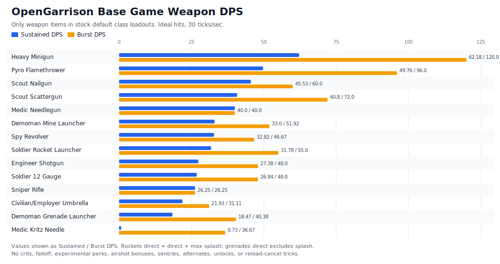

# OpenGarrison Base Game Weapon DPS

Generated from weapon items in each stock class default loadout under `Core/Content/Gameplay/stock.gg2/classes/*.json`. Modern GML, alternates, unlocks, and experimental-only attacks were ignored.

Assumptions: all projectiles hit; 30 ticks/sec; no crits, falloff, experimental perks, airshot bonuses, sentries, or reload-cancel tricks. Sustained DPS simulates holding fire for 180 seconds with the C# reload model.

| Weapon | Slot | Sustained DPS | Burst DPS | Damage/shot | Assumption |
|---|---|---:|---:|---:|---|
| Heavy Minigun | Primary | 62.18 | 120.0 | 8.0 | bullet hit |
| Pyro Flamethrower | Primary | 49.76 | 96.0 | 3.2 | direct flame tick + burn tick |
| Scout Nailgun | Secondary | 45.53 | 60.0 | 12.0 | nail hit |
| Scout Scattergun | Primary | 40.8 | 72.0 | 48.0 | all pellets hit |
| Medic Needlegun | Primary | 40.0 | 40.0 | 4.0 | enemy needle hit |
| Demoman Mine Launcher | Primary | 33.0 | 51.92 | 45.0 | max splash |
| Spy Revolver | Primary | 32.82 | 46.67 | 28.0 | shot hit |
| Soldier Rocket Launcher | Primary | 31.78 | 55.0 | 55.0 | direct hit + max splash |
| Engineer Shotgun | Primary | 27.38 | 48.0 | 32.0 | all pellets hit |
| Soldier 12 Gauge | Secondary | 26.84 | 48.0 | 32.0 | all pellets hit |
| Sniper Rifle | Primary | 26.25 | 26.25 | 35.0 | unscoped shot |
| Civilian/Employer Umbrella | Primary | 21.93 | 31.11 | 28.0 | shot hit |
| Demoman Grenade Launcher | Utility | 18.47 | 40.38 | 35.0 | direct impact |
| Medic Kritz Needle | Secondary | 0.73 | 36.67 | 22.0 | enemy heal-needle hit |
